# Assistant Image Preclassification Specification

- Status: implemented contract and evaluation baseline
- Prompt contracts: `tco-assistant-image-classifier/1.2.0` and `tco-assistant-system/1.3.4`
Research retrieval date: 2026-08-19

## 1. Outcome

When a signed-in user uploads an image without selecting a project, the application MUST identify the visible source-estate family before it asks the main assistant loop to draft a project. The classifier result becomes immutable host context for that request. The draft model cannot select or override the project family.

The supported draft families are:

- `ec2`: SQL Server workloads running on Amazon EC2 with EBS-backed or instance storage.
- `rds`: Amazon RDS for SQL Server DB instances.
- `on_prem`: provider-neutral physical or virtual server inventory without a stronger AWS or SQL PAYG marker.
- `sql_payg`: a SQL Server enabled by Azure Arc Pay-As-You-Go licensing comparison.
- `unknown`: classifier-only outcome when the visible evidence is absent, materially conflicting, or too weak. `unknown` is not a domain `ProjectType` and cannot create a draft.

The result is an estimate input aid, not a licensing determination, entitlement assertion, price quote, or automatic save. The user MUST review the complete unsaved draft.

## 2. Scope

In scope:

- one bounded classifier-only Foundry request before a no-project image draft;
- a closed typed classifier tool with bounded evidence and ambiguity notes;
- host-side confidence gating and project-family locking;
- the existing bounded image draft loop using the fixed family;
- classification details in the image API response and review UI;
- synthetic screenshot fixtures and an opt-in live Foundry evaluation probe.

Out of scope:

- changing the selected-project image patch flow;
- OCR as a separate service or dependency;
- accepting PDFs, workbooks, CSV files, URLs, or arbitrary file types;
- calculating prices or licensing entitlements in the model;
- automatically saving, calculating, sharing, or deleting a project;
- treating model confidence as a calibrated probability;
- sending fixtures or results to any provider other than the approved Foundry data plane.

## 3. Researched Classification Signals

The matrix distinguishes first-party documented terms from synthetic fixture labels. A marker is evidence for a family, not proof that every extracted field is accurate.

| Family | Strong positive markers | Supporting markers | Weak or insufficient alone | Conflict and precedence behavior |
| --- | --- | --- | --- | --- |
| `rds` | `Amazon RDS`, `RDS for SQL Server`, `DB instance class`, `DB identifier`, an instance class beginning `db.`, `Multi-AZ` | RDS storage type/class, provisioned IOPS, `Single-AZ`, license-included SQL edition | CPU, RAM, storage, SQL edition, `gp3`, or `io2` without an RDS marker | RDS-specific markers outrank generic hardware and shared storage terms. A `db.*` class outranks an adjacent generic EC2-looking label unless the image is materially contradictory. |
| `ec2` | `Amazon EC2`, EC2 instance ID, AMI, a non-`db.` EC2 instance type, `EBS` | EBS volume ID, `gp3`, `io2`, instance store, vCPU/RAM in an EC2 inventory | CPU, RAM, storage, SQL edition, or a storage class without EC2 context | EC2-specific markers outrank generic hardware. Any `db.*`, DB identifier, or explicit RDS label is evaluated as stronger RDS evidence. |
| `sql_payg` | Explicit `SQL Server enabled by Azure Arc` or Arc SQL `Pay-as-you-go`/`PAYG`, combined with edition core counts and a billing comparison | Enterprise Edition/`EE` cores, Standard Edition/`SE` cores, annual Software Assurance/`SA` spend, annual usage hours, hourly per-core language | SQL edition, cores, `SA`, or `PAYG` in isolation. `STE` is a synthetic weak OCR alias for `SE`, not an official Microsoft abbreviation, and is insufficient without explicit Arc/PAYG plus the rest of the comparison bundle. | AWS service-specific evidence outranks PAYG-adjacent generic SQL text. A complete Arc/PAYG comparison outranks generic on-premises hardware fields. Conflicting payment language is reported as ambiguity. |
| `on_prem` | `Physical` or `Virtual` server inventory plus provider-neutral core/CPU, RAM/memory, disk/storage, socket, hardware, datacenter, hypervisor, power, capex, or depreciation fields | SQL version/edition, IOPS/throughput, utilization, server count | SQL edition alone or an unlabeled numeric table | Selected only when no stronger AWS, RDS, or complete SQL PAYG marker is visible. |
| `unknown` | No supported source marker, unreadable content, or materially conflicting strong markers | A title or partial row with too little context | A generic `SQL Server` label | MUST use `low` confidence and MUST NOT enter the draft loop. |

Classification precedence is:

1. Identify explicit provider/service markers.
2. Resolve RDS versus EC2 using `db.*`, DB/RDS labels, EC2/AMI/instance identifiers, and storage context.
3. Resolve SQL PAYG only from an explicit Arc/PAYG comparison bundle. Do not infer PAYG from SQL edition.
4. Use `on_prem` only for provider-neutral inventory after excluding stronger markers.
5. Use `unknown` when evidence remains absent or materially conflicting.

## 4. Functional Contract

### 4.1 Intake

The existing authenticated `POST /api/v1/assistant/image` endpoint accepts one declared JPEG or PNG body. The host MUST enforce the existing byte, signature, decoder, dimension, and normalized-output limits. It MUST decode the image, remove source metadata, convert it to RGB, and re-encode it as a request-scoped JPEG before model egress.

The optional `x-tco-project-id` header controls the flow:

- absent: run preclassification, then conditionally draft a new project;
- present and authorized: retain the existing selected-project patch extraction flow and return `classification: null`.

### 4.2 Classifier Request

The pre-draft classifier MUST:

- receive only the normalized image, a fixed host-authored instruction, one neutral user message, and one closed tool schema;
- treat all visible image content as untrusted data and ignore instructions in the image;
- make no price, mapping, entitlement, or draft decision;
- return exactly one `classify_project_type` tool call;
- return one of `ec2`, `rds`, `on_prem`, `sql_payg`, or `unknown`;
- return `high`, `medium`, or `low` confidence;
- quote 1 to 12 short visible evidence strings;
- return 0 to 12 short ambiguity strings;
- retry an otherwise identical classifier request at most twice only when the provider response or typed classifier output is malformed, charging every attempt to the same turn budget;
- stay within 800 output tokens and the remaining whole-turn deadline.

Each evidence or ambiguity entry MUST be non-empty, trimmed, control-character-free, and at most 240 characters. Unknown fields, prose-only responses, the wrong tool, multiple tool calls, an empty call ID, malformed JSON, oversized notes, or `unknown` with non-low confidence MUST fail closed as a malformed model response after the bounded malformed-only attempts are exhausted. Content filtering, authentication, authorization, quota, timeout, and other provider failures MUST NOT use this retry.

### 4.3 Confidence Gate

The confidence labels are routing controls, not probabilities:

- `high`: multiple mutually consistent strong/supporting markers or one uniquely provider-specific marker with corroborating context. Continue to drafting.
- `medium`: a supported family is more likely than alternatives, but one material expected marker is absent or ambiguous. Continue to drafting and expose the uncertainty for review.
- `low`: evidence cannot safely select a project family. Do not draft.

`unknown` always requires `low`. Any family reported with `low` is unresolved even if its `project_type` field is not `unknown`.

For an unresolved result, the endpoint MUST return HTTP success with:

- the complete classification;
- no proposal;
- a stable review message;
- classifier ambiguities, or a host fallback uncertainty when none was reported.

### 4.4 Draft Loop

For a resolved result, the host MUST attach the corresponding domain `ProjectType` to `TurnContext` before the normal image loop starts. The classifier request and tool call MUST count against the same turn budget as the draft loop.

The draft loop receives:

- the same normalized image on its first request only;
- the fixed classified project family in host-authored runtime context;
- only the tools available for an unselected project in the propose phase;
- the existing instruction to extract visible supported fields, use host defaults for missing fields, and report omissions and uncertainties.

The model MUST call `stage_new_project_draft` with the exact host-classified `project_type`. Host preflight MUST reject the entire proposed tool batch when the type differs. The tool then constructs domain types, supplies deterministic defaults, and runs `EditableProject::validate`. The model cannot supply IDs, owner data, revisions, prices, rates, totals, mappings, or persisted state.

For image-extracted SQL data, source RAM, and EC2 volume capacity, the model MUST preserve the visible decimal value and source unit in a closed measurement object. Supported source units are `gb`, `gib`, `tb`, and `tib`. The model MUST NOT discard or convert the unit. Before normal typed project validation, the Rust host deterministically treats GB/GiB values as already canonical and multiplies TB/TiB values by `1024`. Missing or unsupported measurement units fail closed rather than being guessed. The same normalization runs for new drafts and selected-project patch validation, calculation, and staging.

The successful response contains the full unsaved `EditableProject` in an `open_project_draft` proposal. It MUST NOT persist the project or trigger a calculation.

## 5. Typed Contracts

Classifier output:

```json
{
  "project_type": "ec2 | rds | on_prem | sql_payg | unknown",
  "confidence": "high | medium | low",
  "evidence": ["short visible quote"],
  "ambiguities": ["short review note"]
}
```

Image API response:

```json
{
  "answer": "plain text conclusion",
  "classification": {
    "project_type": "rds",
    "confidence": "high",
    "evidence": ["DB instance class db.m6i.2xlarge"],
    "ambiguities": []
  },
  "proposal": {
    "proposal_id": "request-bound opaque identifier",
    "action": "open_project_draft",
    "project": "complete validated EditableProject"
  },
  "omissions": [],
  "uncertainties": []
}
```

`classification` is required by OpenAPI but nullable for the selected-project patch flow. `proposal` is nullable for unresolved classification or a completed extraction with no valid proposal.

## 6. Data Flow

```mermaid
flowchart LR
    Browser[Signed-in browser] -->|bounded JPEG or PNG| API[Axum image endpoint]
    API --> Auth[Authenticate and owner-scope]
    Auth --> Normalize[Decode, bound, strip metadata, normalize JPEG]
    Normalize --> Selected{Selected project?}
    Selected -->|yes| Patch[Existing bounded patch loop]
    Selected -->|no| Classifier[Classifier-only Foundry request]
    Classifier --> Typed[Parse closed typed result]
    Typed --> Gate{Known family and medium/high?}
    Gate -->|no| Review[Classification-only review response]
    Gate -->|yes| Context[Lock ProjectType in host context]
    Context --> Draft[Existing bounded Foundry draft loop]
    Draft --> Preflight[Host policy preflight]
    Preflight --> Domain[Construct and validate EditableProject]
    Domain --> Proposal[Full unsaved draft response]
```



Raw bytes, normalized bytes, classifier output, model transcript, and draft model output are request-scoped. The application MUST NOT persist or log those values. The browser may retain the selected file and response in memory for the active review only.

## 7. Integration Boundaries

### 7.1 Foundry Adapter

Production continues to use only the system-assigned managed identity and the configured private Foundry data plane. There is no API key, service-principal secret, public endpoint fallback, alternate model provider, autonomous hosted agent, or second application runtime.

The synthetic live evaluator is a separate opt-in executable. It MUST:

- use the same request encoder, endpoint/deployment allowlist, classifier, turn loop, tools, host policy, and domain validation as the application;
- default to the interactive user currently signed in to Azure CLI and reject a service-principal or other non-user Azure CLI account;
- allow the explicit `system_assigned_managed_identity` mode only for a controlled Azure-hosted test machine whose system-assigned identity has least-privilege inference RBAC and private network access to the approved Foundry account;
- construct `ManagedIdentityCredential` without a client or resource ID in system-assigned mode, and never accept a user-assigned identity, service-principal credential, key, pre-minted token, or implicit credential chain;
- require an explicit synthetic-egress acknowledgement;
- use only synthetic committed screenshots;
- perform no Azure resource mutation and no application persistence;
- write sanitized results locally without endpoint, tenant, subscription, token, identity, or routed-model values.

The evaluator is not compiled into the normal application build unless its dedicated Cargo feature is enabled. It is non-blocking evidence because model routing and extraction are nondeterministic.

### 7.2 Frontend

The frontend MUST validate the untrusted response at runtime before rendering it. The review panel shows detected family, confidence, evidence, ambiguities, complete proposed fields, omissions, and uncertainties before the user opens the unsaved draft. Model text is rendered as text, never HTML.

### 7.3 OpenAPI

`openapi/openapi.yaml` is authoritative. Any classifier response change MUST update OpenAPI, regenerate `web/src/lib/api/generated.ts`, and retain strict frontend runtime validation.

## 8. Synthetic Fixture Corpus

The committed corpus lives under `tests/assistant-workload-classification/<family>/<case>/`. It contains 15 cases: five EC2, four RDS, three on-premises, and three SQL PAYG fixtures. Every case contains:

- `fixture.html`: deterministic synthetic source used to render the screenshot;
- `input.png`: the retained screenshot sent to the normalizer and model;
- `expected.json`: expected family, minimum confidence, required visible markers, and draft assertions;
- `result.md`: complete latest live probe response for manual review, including the full draft JSON or a clear not-run/failure status.

No fixture reproduces a provider console, customer document, customer identifier, commercial term, negotiated price, or copyrighted screenshot. Product terms are limited to the small labels required to test classification.

| Case | Distinguishing markers | Expected draft focus |
| --- | --- | --- |
| `ec2/ec2-01` | Amazon EC2, instance ID, `m7i.4xlarge`, EBS `gp3` | one Standard EC2 resource and visible disk/performance fields |
| `ec2/ec2-02` | AMI, `r6i.2xlarge`, EBS `io2` | one Enterprise EC2 resource with BYOL and annual hours |
| `ec2/ec2-03` | EC2 inventory, quantity, `r6id.8xlarge`, two EBS rows | one repeated EC2 workload with two volumes |
| `ec2/ec2-04` | sparse spreadsheet, EC2, `r6i.8xlarge`, Windows with SQL Server Standard | one Standard EC2 resource using defaults for unspecified fields |
| `ec2/ec2-05` | sparse spreadsheet, EC2, `r5.2xlarge`, Windows with SQL Server Standard | one Standard EC2 resource using defaults for unspecified fields |
| `rds/rds-01` | Amazon RDS, DB identifier, `db.m6i.2xlarge`, Multi-AZ | one Standard RDS resource with storage and IOPS |
| `rds/rds-02` | RDS for SQL Server, `db.r6i.4xlarge`, Single-AZ | one Enterprise RDS resource with visible commercial term |
| `rds/rds-03` | DB instance class, Multi-AZ, license included | one repeated RDS resource without EC2 volumes |
| `rds/rds-04` | sparse spreadsheet, RDS, `db.r5.xlarge`, SQL Server Standard | one Standard RDS resource using defaults for unspecified fields |
| `on_prem/on-prem-01` | Physical server, cores, memory, disks, power | one Standard on-premises resource with hardware inputs |
| `on_prem/on-prem-02` | VMware virtual server inventory without cloud IDs | one Enterprise on-premises resource with utilization omissions |
| `on_prem/on-prem-03` | SQL Server edition plus generic server hardware only | one on-premises resource; SQL edition alone must not select PAYG |
| `sql_payg/sql-payg-01` | Arc PAYG, Enterprise and Standard cores, annual SA, hours | no resources; complete `sql_payg` settings |
| `sql_payg/sql-payg-02` | Pay-as-you-go comparison using `EE`, `SE`, and `SA` | no resources; abbreviated visible values mapped for review |
| `sql_payg/sql-payg-03` | Explicit Arc PAYG bundle with synthetic OCR alias `STE` | no resources; weak alias accepted only with strong PAYG context |

Fixture assertions MUST ignore host-generated UUIDs, proposal IDs, model prose wording, and other nondeterministic values. They MUST verify exact project family, minimum confidence, expected resource shape, and case-specific visible values.

## 9. Evaluation Result Contract

Each `result.md` MUST be overwritten atomically for every attempted live run and contain:

1. fixture case and UTC evaluation time;
2. classifier and draft prompt versions;
3. non-sensitive evaluator identity mode, expected family, and observed family/confidence;
4. pass/fail against deterministic assertions;
5. complete classifier evidence and ambiguities;
6. complete assistant answer, omissions, and uncertainties;
7. complete generated proposal/draft JSON with local opaque IDs normalized to placeholders;
8. a sanitized error category when no complete response exists.

The file MUST NOT contain credentials, tokens, endpoint/deployment names, tenant/subscription/resource identifiers, signed-in identity, raw response headers, upstream error bodies, routed model names, or user/customer data.

## 10. Failure and Safety Behavior

- Authentication, rate-limit, semaphore, normalization, timeout, transport, quota, content-filter, and malformed-model failures retain the existing sanitized HTTP problem behavior.
- A valid low-confidence result is a reviewable non-error response with no draft.
- A type mismatch in any draft tool call fails closed at host preflight; it is never silently corrected.
- One failed live fixture does not erase other case results. The evaluator returns a nonzero process status when any case is incomplete or fails an assertion.
- No live result is a deterministic CI gate. Mocked classifier, policy, endpoint, and frontend tests remain the required CI evidence.

## 11. Telemetry

Structured completion metadata may include request ID, prompt versions, selected-project presence, classified family, confidence, sanitized routed-model metadata, request/tool counts, and normalized dimensions. Logs MUST exclude image bytes, visible text, evidence strings, ambiguities, model messages, tool arguments/results, project/workload names, identity headers, owner IDs, endpoints, credentials, and full draft content.

Recommended aggregate measures are classification counts by family/confidence, unresolved rate, mismatch rejection count, sanitized failure category, and draft completion latency. These are operational signals, not model-quality truth labels.

## 12. Acceptance Criteria

The feature is complete when:

1. all typed classifier parser tests pass, including unknown/low gating and malformed output rejection;
2. no-project image endpoint tests cover on-premises, SQL PAYG, uncertain classification, type mismatch, and complete proposal output;
3. selected-project image tests prove the classifier is not run and patch behavior is unchanged;
4. policy tests prove the classified family cannot be overridden;
5. OpenAPI generation, strict TypeScript validation, Svelte checks, and focused frontend tests pass;
6. all 12 retained PNG fixtures decode within production limits and match their `expected.json` metadata;
7. the opt-in evaluator compiles with the locked dependency graph, rejects missing acknowledgement or a non-user Azure CLI identity in its default mode, and accepts only the explicit host system-assigned identity as its alternate mode;
8. a controlled live run attempts every fixture and writes one sanitized `result.md` beside each screenshot;
9. formatting, Clippy, locked Rust tests, frontend lint/test/build, and applicable dependency checks pass or precise environmental blockers are recorded;
10. image extraction tests prove GB/GiB identity normalization, TB/TiB conversion to GB by the Rust host, selected-project parity, and fail-closed unsupported units;
11. no customer data, secret, credential, private endpoint, tenant/subscription identifier, or production value enters the corpus or results.

## 13. Sources

All sources were retrieved on 2026-08-19. They establish terminology and inventory fields only; the synthetic labels, confidence policy, precedence, and fixture values are application design decisions.

AWS documentation:

- [Amazon EC2 instance type names](https://docs.aws.amazon.com/ec2/latest/instancetypes/instance-type-names.html)
- [Amazon EBS volume types](https://docs.aws.amazon.com/ebs/latest/userguide/ebs-volume-types.html)
- [What is Microsoft SQL Server on Amazon EC2?](https://docs.aws.amazon.com/sql-server-ec2/latest/userguide/what-is.html)
- [DB instance classes](https://docs.aws.amazon.com/AmazonRDS/latest/UserGuide/Concepts.DBInstanceClass.Types.html)
- [Amazon RDS for Microsoft SQL Server](https://docs.aws.amazon.com/AmazonRDS/latest/UserGuide/CHAP_SQLServer.html)
- [Multi-AZ DB instance deployments](https://docs.aws.amazon.com/AmazonRDS/latest/UserGuide/Concepts.MultiAZSingleStandby.html)

Microsoft documentation:

- [Manage licensing and billing of SQL Server enabled by Azure Arc](https://learn.microsoft.com/sql/sql-server/azure-arc/manage-license-billing?view=sql-server-ver17)
- [SQL Server enabled by Azure Arc](https://learn.microsoft.com/sql/sql-server/azure-arc/overview?view=sql-server-ver17)
- [Build a business case or assess servers using an imported CSV file](https://learn.microsoft.com/azure/migrate/tutorial-discover-import?view=migrate)
- [Review discovered inventory in Azure Migrate](https://learn.microsoft.com/azure/migrate/how-to-review-discovered-inventory?view=migrate)
- [Metadata that an Azure Migrate appliance discovers](https://learn.microsoft.com/azure/migrate/discovered-metadata?view=migrate)

Microsoft documentation describes `SE` as Standard Edition. `STE` appears only in the synthetic corpus as an intentionally noisy OCR-like alias and MUST NOT be presented as official terminology.