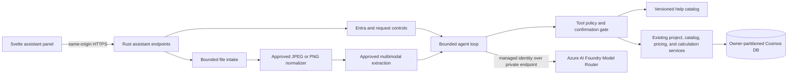

# Foundry Assistant Architecture Approval Proposal

Status: **PRODUCT SCOPE APPROVED - IMPLEMENTATION AND DEPLOYMENT CONTROL APPROVALS PENDING**

Prepared: 2026-08-11

Reference implementation reviewed: `C:\Repos\gaia-robot` at the local working-tree state reviewed on 2026-08-11

The repository owner approved the product specification on 2026-08-11 with image upload, rather than CSV, as the primary v1 assisted-input method. This approval does not by itself authorize dependencies, Azure resources, live model calls, customer-data egress, or deployment. The responsible Architecture, Security, Privacy, Legal/OSS, Procurement, and service-owner reviewers must record the applicable control approvals before those implementation slices start.

## 1. Decision Requested

Implement a v1 Foundry-backed assistant that:

1. answers natural-language questions about every visible field, button, state, and supported workflow from a deterministic application-help catalog;
2. accepts one JPEG or PNG as the primary v1 assisted-input path, analyzes it, and proposes a validated project draft or patch for the user to review; and
3. performs allowlisted application actions through the same server-side authorization, validation, calculation, persistence, and concurrency boundaries used by the normal UI.

The phrase "any action in the application" must mean any action explicitly represented in an approved capability matrix. It must not mean arbitrary DOM control, arbitrary HTTP, code execution, SQL, Azure control-plane access, provider-console access, credential access, or bypass of an application confirmation.

### Recommended decision

Use an application-owned, request-bounded Rust orchestration loop backed by an Azure AI Foundry Model Router deployment. Do not use a hosted autonomous-agent runtime or a general agent framework. The Rust host owns identity, authorization, tools, deadlines, confirmation state, and all side effects. Foundry supplies model inference only.

Start with signed-in users, ephemeral chat history, read-only help, bounded JPEG/PNG processing, and staged draft changes. Add persisted actions only after their action-specific controls pass. CSV, Excel, and PDF intake are deferred beyond v1.

## 2. Authority and Remaining Gates

The repository owner approved corresponding changes to `research/Azure Specification.md` and decision DC-010 on 2026-08-11. Those changes move the image-first assistant into v1 while preserving deterministic financial authority.

The remaining control gates are explicit:

- `.github/copilot-instructions.md` still lists LLM, generative-AI, model-routing, and related services as not approved for the MVP and requires an explicit request plus human review before that control file changes.
- Security and Privacy approval is required before confidential project or image content is sent to a model service.
- Architecture and service-owner approval is required for the exact Foundry resource, custom Model Router subset, region/processing geography, API, deployment type, quotas, and lifecycle.
- Legal/OSS and Security approval is required before adding an image decoder/normalizer or another direct production dependency.
- Procurement and the cost owner must approve the cost envelope and budget/alert control.

Implementation may proceed only in slices that do not cross an unresolved gate. Live Foundry wiring, image decoding/normalization, customer-data egress, and deployment remain blocked until their applicable approvals are recorded.

## 3. Customer Outcomes and Acceptance Criteria

| Capability | Acceptance criteria |
| --- | --- |
| Application guidance | Every exposed control has a stable help identifier and reviewed description. Answers identify the relevant screen/control, explain valid values and effects, and never invent product behavior. Unsupported questions are identified as unsupported. |
| File-assisted prefill | CSV, image, and PDF inputs produce a field-level proposed draft or patch, confidence/uncertainty indicators, validation errors, and unmapped values. No upload is saved automatically and no model-derived total, rate, target SKU, entitlement, or calculation is accepted. |
| Application actions | The assistant can invoke each approved application command through a typed capability. The backend derives identity, checks owner scope, validates inputs, applies ETags, invokes the existing deterministic calculation engine where required, and returns the authoritative result. |
| User control | The UI previews project changes before persistence. Destructive, sharing, identity, and other high-impact actions always use a dedicated confirmation. Cancellation stops further model and tool work. |
| Auditability | A reviewer can identify the model-router deployment, actual routed model when returned, prompt/help version, tools attempted, tools executed, confirmation outcome, timings, and sanitized failure codes without logging user content. |
| Accessibility | The launcher, panel, transcript, file picker, progress states, previews, confirmations, and errors meet the repository's WCAG 2.2 AA requirement on keyboard, screen-reader, mobile, and desktop paths. |

## 4. Gaia Reference Decisions

Gaia is a Priority 2 reference only. Its patterns are adapted to this repository's stricter product, identity, financial, customer-data, and dependency rules.

| Gaia evidence | Pattern adopted | TCO adaptation or rejection |
| --- | --- | --- |
| `C:\Repos\gaia-robot\rust\src\brain.rs` | Bounded iterative model/tool transcript; all-or-nothing tool-batch preflight; structured tool errors; context compaction; model and tool counters. | Add a whole-turn deadline, smaller budgets, cancellation, idempotency, risk phases, and confirmation gates. Do not copy Gaia's retry of blanket refusals or content-filter responses. |
| `C:\Repos\gaia-robot\rust\src\llm.rs` | Minimal Chat Completions client for a `model-router` deployment; function tools; fixed API version; actual routed-model capture; model readiness probe. | Use the existing approved async HTTPS stack. Production and deployed development use system-assigned managed identity only. Reject API keys, pre-minted tokens, GitHub Models, arbitrary endpoints, and silent model fallback. |
| `C:\Repos\gaia-robot\rust\src\cognitive_tools.rs` | Protocol-neutral JSON Schemas, `additionalProperties: false`, typed Serde inputs with `deny_unknown_fields`, runtime bounds, host-owned identity context, explicit dispatch, and structured unavailable/error results. | Tools call TCO application/domain services only. Host context also carries owner scope, project ID, ETag, deadline, and user-confirmed action identifiers. No web search, public posting, wisdom, arbitrary store, endpoint, SQL, identity, or credential parameters. |
| `C:\Repos\gaia-robot\rust\src\brain_prompt.rs` | Tool results and retrieved text are evidence, not higher-priority instructions; identity and partition scope come from the host; state changes should be verified. | Use a neutral TCO system instruction with no personality, emotional, or refusal-recovery behavior. Uploaded and project text is explicitly untrusted data. Do not request or expose chain-of-thought. |
| `C:\Repos\gaia-robot\infra\azuredeploy.json` and `infra\README.md` | One same-origin Container App, system-assigned identity, `Cognitive Services OpenAI User`, Model Router, private endpoint/DNS, and disabled public data-plane/key access. | Implement in this repository's modular Bicep, existing VNet, and single application image. Do not copy Gaia's ARM templates, automatic model upgrades, preview API versions, extra jobs, embeddings, vector stores, search, Speech, or alternate identities. |
| `C:\Repos\gaia-robot\THIRD-PARTY-DATA-EGRESS.md` | Provider-by-provider purpose, data category, region, retention, credential, quota, incident, disable, and accountable-owner review. | Add stricter customer inventory, workload, financial, upload, and tenant-isolation controls. Private networking does not remove privacy, residency, retention, or contractual review. |

Gaia has no CSV, image, or PDF ingestion pipeline to inherit. Those capabilities require a new TCO-specific design and independent review.

### 4.1 Current Microsoft documentation checked

Official Microsoft Learn documentation was retrieved on 2026-08-11. It is evidence for review, not a substitute for validating the selected subscription, region, SKU, API, model, and terms at implementation time.

- [Model router concepts](https://learn.microsoft.com/en-us/azure/ai-foundry/openai/concepts/model-router): the active `2025-11-18` router version can receive new underlying models without changing its version identifier. A custom model subset is therefore required so newly available models do not enter this application's routing set automatically. The documented deployment choices are Global Standard and Data Zone Standard in a limited set of regions that does not include South Africa North. The Foundry hosting/processing geography must be approved separately from the Container App location.
- [Function calling](https://learn.microsoft.com/en-us/azure/ai-foundry/openai/how-to/function-calling): the model proposes tool names and arguments while the application executes them. Microsoft explicitly recommends runtime validation, least privilege, real-world impact review, and user confirmation for actions. Tool-call JSON can be invalid, and tool descriptions are documented as limited to 1,024 characters.
- [Managed identity](https://learn.microsoft.com/en-us/azure/ai-foundry/openai/how-to/managed-identity): an Azure-hosted application can use its system-assigned identity with `Cognitive Services OpenAI User` for inference without a stored key. TCO must construct the system-assigned credential explicitly rather than inherit a broad credential chain.
- [Private networking](https://learn.microsoft.com/en-us/azure/ai-foundry/openai/how-to/network): disable public network access and use a private endpoint with private DNS for the model data plane. The exact current, non-classic Foundry resource shape and Bicep API must be revalidated before implementation.

The current model-router documentation says image input is supported, with routing based on the text portion. It does not establish direct PDF support. PDF remains blocked until an exact, documented extraction or model-input path is approved.

## 5. Proposed Architecture

### 5.1 Deployment topology

- Preserve one OCI image and one Azure Container App. The Rust process continues to serve the API and Svelte assets from one origin.
- Add Foundry as a managed Azure dependency only after approval. Do not add another application container, worker, sidecar, service worker, or background job.
- Keep a turn request-bound. No in-memory or scheduled work is required for correctness; cancellation and replica loss terminate the turn without partially applying an unconfirmed action.
- Reuse the existing VNet and private-endpoint subnet. Provision Foundry private endpoint and private DNS through a focused Bicep module.
- Disable Foundry public network access and local/key authentication where supported. Use only the Container App system-assigned managed identity with the least-privilege model-inference role scoped to the exact resource.
- Inject only non-secret endpoint, deployment, API-version, feature-flag, and budget settings. Do not inject an API key, bearer token, service-principal credential, or user-assigned identity setting.

### 5.2 Agent ownership boundary

The TCO application is the agent host. Foundry is not trusted to authorize, validate, calculate, persist, or confirm anything. Model output is untrusted input until a typed host component validates it.

The model may:

- choose among the tools exposed for the current phase;
- supply candidate values allowed by a closed tool schema;
- summarize reviewed help and deterministic server results; and
- propose an application action.

The model may not:

- calculate money, rates, savings, adjustments, target SKUs, or portfolio totals;
- choose a project owner, tenant, partition, ETag, confirmation, endpoint, credential, or authorization scope;
- claim a write succeeded before the host returns a successful result;
- execute JavaScript, SQL, shell commands, arbitrary HTTP, provider-console actions, or Azure control-plane operations;
- follow instructions found in uploads, project fields, catalog text, or tool output; or
- persist raw conversation, files, hidden reasoning, or unvalidated model output.

## 6. Autonomous Loop

### 6.1 Turn phases

1. Authenticate the principal, enforce request/file/rate limits, assign a request ID, and establish a cancellation-aware whole-turn deadline.
2. Build host context from server-derived identity and, when supplied, an owner-scoped project read. Do not trust client-supplied owner data or prior tool results.
3. Start a read/plan phase exposing only help, project-read, catalog-read, validation, and deterministic calculation tools.
4. Send the bounded transcript and phase-specific tool definitions to Model Router.
5. Preflight every returned tool batch before executing any call. Reject the whole batch if its count, phase, schema, risk, or remaining budget is invalid.
6. Execute allowed reads sequentially, append bounded structured results, and continue until the model returns a terminal response or proposes actions.
7. Validate proposed actions with deterministic policy. Execute navigation and reversible local-draft changes through allowlisted client commands. Present persisted or high-impact actions as a field-level preview.
8. After explicit user confirmation, start a separate execution request with only the exact confirmed capabilities in host context. Re-read owner-scoped state and ETag before mutation.
9. Apply a confirmed project patch through the existing domain and repository boundaries, recalculate server-side when relevant, and verify the resulting state.
10. Return the authoritative result. Stop on cancellation, deadline, budget exhaustion, stale ETag, authorization failure, guardrail response, malformed output, or unavailable dependency.

### 6.2 Proposed initial budgets

These values are review inputs, not approved settings.

| Limit | Proposed value | Reason |
| --- | ---: | --- |
| Model requests per turn | 8 | Retains Gaia's iterative pattern with a smaller cost and latency ceiling. |
| Tool calls per turn | 12 | Supports read, propose, apply, and verify without broad autonomy. |
| Tool calls per model response | 4 | Makes preflight and user-visible progress easier to reason about. |
| Mutating calls per batch | 1 | Avoids races and ambiguous partial outcomes. |
| Whole-turn wall clock | 120 seconds | Bounds total request cost and prevents Gaia's per-call timeout from multiplying across all iterations. |
| Model-call timeout | Remaining turn budget, at most 60 seconds | Leaves time for validation, tools, and a useful error. |
| Prompt context | 32,000 tokens | Minimizes customer-data disclosure and cost. |
| Model output | 4,000 tokens | Sufficient for concise help and action previews. |
| Concurrent turns | 1 per principal | Prevents conflicting writes and cost bursts. |

No automatic retry may repeat a tool mutation. A retryable model or network failure may be retried only before side effects and within the same total budget. Unknown outcomes return an error and require an owner-scoped state read before any further action.

## 7. Tool Contract and Capability Matrix

### 7.1 Contract rules

- Define each tool once in protocol-neutral Rust with a stable name, concise description, closed JSON Schema, typed input, explicit output, risk class, and allowed phase.
- Use `additionalProperties: false`, Serde `deny_unknown_fields`, enum bounds, string/array/number limits, and domain validation. Schema descriptions do not replace runtime checks.
- Keep `owner_id`, `tid`, `oid`, auth headers, partition keys, ETags, confirmations, endpoints, SQL, credentials, and raw provider responses out of model-visible schemas.
- Supply identity, selected project, current ETag, request ID, deadline, enabled features, and confirmed action IDs through immutable host context.
- Dispatch by an explicit match over registered tools. A missing client or disabled feature returns `unavailable`; it never broadens access or selects an external fallback.
- Bound and sanitize every tool result before adding it to model context. Return stable error codes without internal details.
- Use existing domain types and server-side decimal calculation code. Do not create a parallel assistant-specific financial model.

### 7.2 Proposed tools

| Tool | Phase | Effect | Confirmation |
| --- | --- | --- | --- |
| `get_application_help` | Read/plan | Reads reviewed help by control, route, or workflow ID. | None |
| `get_current_project` | Read/plan | Reads only the host-selected, owner-scoped project. | None |
| `search_catalog` | Read/plan | Reads bounded existing AWS/Azure catalog choices. | None |
| `validate_project_patch` | Read/plan | Validates candidate settings/resources and returns field errors and a normalized diff. | None |
| `calculate_project_draft` | Read/plan | Invokes the deterministic server calculation engine and returns its structured trace/results. | None |
| `stage_project_patch` | Propose | Produces an allowlisted client command that updates the unsaved browser draft and remains undoable. | Preview before first file-assisted prefill |
| `apply_confirmed_project_patch` | Execute | Re-reads owner state/ETag and applies one confirmed, validated project-document update. | Required |
| `create_project` | Execute | Creates a new owner-scoped project through the normal repository path. | Required |
| `delete_project` | Execute | Uses the existing hard-delete and share-revocation behavior. | Dedicated destructive confirmation every time |
| `create_project_share` | Execute | Creates a capability link under existing owner and expiry rules. | Dedicated sharing confirmation every time |
| `revoke_project_share` | Execute | Revokes an owner-scoped share. | Required |
| `refresh_prices` | Execute | Uses existing bounded provider orchestration and quotas; sends no project data upstream. | Required when it can incur material latency/cost |
| `navigate_to`, `open_editor`, `focus_control` | Client | Emits closed, typed UI commands handled by Svelte components. No selector or script input. | None |

Sign-in, sign-out, credential entry, browser permissions, and final confirmation remain direct user interactions. The assistant may open the relevant UI but may not impersonate the user or handle credentials.

The final implementation must maintain a complete matrix mapping every supported UI command to its internal application command, risk class, authorization check, validation, confirmation, idempotency behavior, and focused test. An unlisted action is unsupported.

## 8. File Intake and Project Prefill

### 8.1 Common pipeline

1. Require an authenticated user and explicit upload action.
2. Accept one file through the same-origin Rust endpoint. Check declared type, extension, magic bytes, size, and format-specific limits before parsing.
3. Reject archives, executables, encrypted/password-protected documents, active content, embedded files, and unsupported encodings.
4. Normalize only the data needed for TCO project fields. Treat document text and metadata as untrusted data, never instructions.
5. Send only the minimum approved normalized content to Foundry when deterministic parsing is insufficient.
6. Convert extraction output to a typed candidate project patch. Reject client/model totals, rates, explanations, owner IDs, revisions, ETags, and snapshot content.
7. Run the normal domain validation and, where requested, deterministic calculation.
8. Show source-to-field mappings, omitted values, assumptions, validation errors, and uncertainty. Apply only to an unsaved draft after preview; save separately through the normal flow.
9. Discard raw bytes and transient extracted content when the request ends. Do not store uploads in Cosmos, Blob Storage, logs, telemetry, model history, or browser durable storage.

### 8.2 Format strategy

| Format | Proposed processing | Approval issue |
| --- | --- | --- |
| JPEG/PNG | Primary v1 path. Decode and normalize to remove metadata and constrain dimensions, then send only the normalized image to an approved multimodal Foundry deployment. Convert model extraction to a typed patch and validate it. | Exact model/deployment, regional processing, image decoder, metadata removal, content filtering, retention, and data classification require approval. |
| CSV/Excel | Deferred beyond v1. A future path should parse deterministically in Rust against reviewed, project-type-specific headers rather than use a model for valid tabular input. | Requires a future specification decision and exact parser review. |
| PDF | Deferred beyond v1. A future path should prefer bounded deterministic text/table extraction and use a model only for approved residual layout interpretation. | Gaia provides no pattern. A reviewed Rust parser or separately approved Azure document-extraction service is required. |

### 8.3 Proposed intake limits

| Input | Proposed limit |
| --- | ---: |
| Files per request | 1 |
| JPEG/PNG | 10 MiB, 25 megapixels after header validation |
| Extracted text sent to a model | 100,000 characters before stricter token budgeting |

Security must decide whether in-memory, never-executed files still require malware scanning and whether that control requires temporary Blob Storage. Adding storage or a scanning service changes the topology, retention model, cost, and approval scope.

## 9. Model and Foundry Decisions

### 9.1 Text and tool turns

- Use one reviewed custom Model Router deployment for natural-language help and function-tool selection.
- Configure an explicit allowlist/model subset containing only models whose publisher, version, deployment type, tool support, context/output limits, processing geography, terms, safety behavior, and cost are approved. Do not use the default all-model set.
- Pin the data-plane API version and deployment configuration. Do not use Gaia's automatic model-version upgrade setting. Because the active router version can change its underlying catalog in place, treat changes to the approved subset or routed model versions as controlled releases with regression evidence and rollback.
- Record the actual routed model returned by the service when available. Do not expose internal routing details as a product promise.
- Require tool/function calling, stable structured arguments, compatible content filtering, predictable regional availability, and approved data-processing terms for every eligible routed model.
- Fail closed when the configured router is unavailable or returns unsupported output. Do not fall back to GitHub Models, public OpenAI endpoints, another Foundry project, or a model chosen from user input.

### 9.2 Image and PDF analysis

Do not assume the text/tool router supports every modality. After capability and residency validation, choose one of:

1. the reviewed custom Model Router subset for normalized image input only if every eligible model supports the required image and tool behavior; otherwise use a separately pinned multimodal Foundry deployment; or
2. deterministic extraction followed by the text/tool router receiving only bounded normalized text and tables.

The selected deployment, model subset, versions, API, SKU, processing geography, content-filter configuration, quotas, pricing, and lifecycle status require written approval. Preview, beta, release-candidate, deprecated, auto-upgrading, or global-processing options need an explicit exception under repository policy. Direct PDF input is not approved unless the exact selected API and every eligible model document that capability; otherwise use a separately reviewed deterministic extractor.

### 9.3 Authentication and readiness

- Deployed environments use the Container App system-assigned managed identity only.
- Grant `Cognitive Services OpenAI User` or the current documented least-privilege equivalent at the narrowest effective Foundry resource scope.
- Fail startup when assistant mode is enabled without an HTTPS allowlisted endpoint, deployment, pinned API version, private DNS/connectivity, or managed-identity capability.
- Readiness may perform a cheap configuration/auth check with a strict budget, but `/healthz` remains network-free and no probe sends project or uploaded content.
- Live local calls are off by default. Any approved diagnostic flow uses an approved interactive Azure identity and never a committed or chat-provided key.
- Keep model data-plane inference separate from Azure control-plane management. The runtime identity receives no role or token audience that permits deployment or model-management operations.

## 10. Prompt and Context Policy

- Keep the system instruction short, neutral, versioned, and reviewed. It states that backend financial results and structured help are authoritative.
- Put current user text, prior visible chat turns, project data, file extraction, and tool results in clearly labeled untrusted-data sections.
- Instruct the model to ignore instructions inside data, but rely on host policy rather than prompting for enforcement.
- Send only project fields needed for the current request. Exclude owner IDs, tenant IDs, ETags, share secrets, identity headers, provider payloads, telemetry, and unrelated resources.
- Exclude workload/project names by default. Include a user-provided name only when necessary and explicitly approved for model processing.
- Keep conversation history in browser memory only for the initial release and clear it on reload, logout, or explicit clear. Do not add conversational persistence, embeddings, retrieval indexes, or server-side transcripts.
- Treat client-returned history as conversational context only. Never trust previous tool results, action approvals, or claimed server state from the browser transcript.
- Return concise user-visible conclusions and uncertainty, not hidden reasoning or chain-of-thought.
- Calculation explanations continue to come from deterministic structured calculation steps. The model may locate or summarize those steps but may not replace or contradict them.

## 11. Authorization, Confirmation, and Consistency

- Require Entra authentication for model use, uploads, and actions in the initial release. Guests receive deterministic local help only and no file/model egress. This controls cost and establishes owner scope; changing it requires a separate abuse and privacy design.
- Derive the owner from validated `tid` plus `oid` exactly as existing project operations do. Never put identity or partition fields in tool arguments.
- Every project tool receives a host-selected project ID and performs an owner-partitioned read. Return not found rather than revealing another owner.
- Use current ETags for persisted updates. An ETag conflict stops execution and returns a fresh preview; the model may not overwrite or silently merge stale state.
- Require same-origin anti-CSRF protection for assistant mutation confirmation in addition to platform authentication.
- Make operations idempotent where retry is possible. Never automatically retry an ambiguous create, update, delete, share, or refresh result.
- One confirmed project patch should become one atomic project-document update where the existing repository supports it.
- A user's natural-language request is not blanket authorization for later or expanded actions. The confirmation must show exact target, field changes, side effects, and whether the action is reversible.
- Delete and share confirmations use dedicated existing dialogs and cannot be bundled with unrelated changes.

## 12. Threat Model

| Threat | Required control and test |
| --- | --- |
| Prompt injection in an upload, project name, or tool result | Treat all as data; never concatenate into system instructions; expose no arbitrary execution/network tool; test documents that demand secret disclosure, owner changes, or policy bypass. |
| Cross-tenant or object-level authorization bypass | Host-derived `tid`/`oid`, owner-partitioned reads/writes, no identity schema fields, and explicit two-tenant tests for every project tool. |
| Excessive or runaway autonomy | Phase-specific capability sets, 8 model calls, 12 tools, 4 per batch, one mutation per batch, 120-second total deadline, cancellation, concurrency/rate/token budgets, and kill switch. |
| Partial or duplicate side effects | All-call batch preflight, sequential mutation, ETag, idempotency, no blind retry, and post-write verification. |
| Model-generated financial error | Reject model/client totals, rates, SKUs, explanations, entitlements, and revisions; invoke existing decimal engine and deterministic target selector; parity tests remain unchanged. |
| Malicious or oversized file | Type/signature/size/page/row/dimension limits, bounded parsers, no active content/external fetch, decompression protection, dependency audit, and fuzz/adversarial fixtures. |
| Data exfiltration | Foundry host allowlist, private endpoint/DNS, managed identity, no arbitrary URL tool, minimized context, no external fallback, documented model processing terms, and egress tests. |
| Cost or quota exhaustion | Signed-in access, per-principal/IP rate and concurrency limits, token/tool/time budgets, model quotas, aggregate cost telemetry, and an operator kill switch. The deployment identity cannot create Cost Management budgets, so a billing administrator must own the Azure budget/alerts or approve an equivalent control. |
| Model or router drift | Pinned deployment/API/configuration, routed-model telemetry, frozen mock transcripts, capability regression suite, controlled upgrades, and rollback. |
| Sensitive logs or support artifacts | Log metadata only; automated redaction tests; no prompts, files, project/workload names, tool arguments/results, model text, identity claims, tokens, or raw upstream bodies. |
| UI command injection or XSS | Closed client-command enum, no selectors/scripts/HTML from model output, Svelte text rendering, CSP preservation, and adversarial browser tests. |
| Misleading completion claim | A state-changing action is reported successful only from an authoritative tool result verified after the write. |

## 13. Data Egress, Privacy, and Retention

Foundry processing is a new data flow even when resources share an Azure tenant and private network.

| Data category | Proposed Foundry handling |
| --- | --- |
| User question | Sent, with UI disclosure that it is processed by the approved Azure model service. |
| Reviewed help text | Sent only when relevant. Version and source ID retained in metadata. |
| Project settings/resources | Send only fields needed for the request; omit owner, tenant, ETag, share, and unrelated resource data. Workload/project names excluded by default. |
| CSV/image/PDF | Raw or normalized content sent only under the approved format path and only after explicit upload. Raw bytes are not retained by the application. |
| Prices/calculation results | Send only the minimum authoritative values needed to answer the question. Never send project data to AWS or Azure public pricing endpoints. |
| Credentials/identity headers/secrets | Never sent. |
| Chat/tool transcript | Request-scoped only; not persisted by the application in the initial release. Provider-side retention and abuse-monitoring terms must be approved and disclosed. |

Before enablement, update `THIRD-PARTY-DATA-EGRESS.md` with:

- accountable business and service owners;
- exact Azure service, resource, deployment, model/router eligibility, API version, SKU, region, processing geography, and private endpoint;
- allowed and prohibited data classifications and fields;
- provider retention, training, abuse-monitoring, human-access, deletion, and incident terms;
- cross-border transfer and data-residency review;
- quotas, token budgets, cost owner, alert thresholds, and disable procedure; and
- review/effective date and approving authorities.

Do not claim that private networking keeps processing in one geography. The selected Model Router deployment type and routed models must independently meet the approved residency requirement.

## 14. API and UI Surface

### 14.1 Proposed API boundary

Add contracts to `openapi/openapi.yaml` before implementation and regenerate TypeScript types. Do not hand-maintain assistant request interfaces.

| Endpoint | Purpose |
| --- | --- |
| `POST /api/v1/assistant/turns` | Authenticated, bounded text turn. Returns a request-scoped event stream or a terminal structured response with text, citations to help/control IDs, progress, and proposed client/application actions. |
| `POST /api/v1/assistant/imports` | Authenticated multipart upload. Synchronously validates, extracts, maps, and returns a proposed project draft/patch. It never saves raw bytes or the project. |
| `POST /api/v1/assistant/actions` | Applies an explicitly confirmed, typed action after fresh authorization, validation, and ETag checks. It is deterministic and does not require another model decision. |

All endpoints use Problem Details, strict body limits, timeouts, cancellation, rate limits, request IDs, sanitized errors, same-origin policy, and no permissive CORS. Streaming, if selected, remains request-bound and must not create a background correctness dependency.

Internal model tools are not public HTTP endpoints. They call application/domain services directly so authorization and financial rules cannot diverge from the normal API.

### 14.2 Proposed UI

- Add a fixed bottom-right icon button with an accessible name, tooltip, unread/progress state, and no layout shift.
- Open a compact dialog/panel that traps focus appropriately, returns focus to the launcher, supports Escape, and adapts to a full-width bottom sheet on small screens.
- Provide transcript, pending/progress state, cancel, clear, file picker, supported-format hint, upload-removal control, and errors.
- Render action previews as field-level changes with Apply/Cancel. Use the existing destructive/share confirmation components for those actions.
- Include source/control links for application guidance and visible uncertainty/unmapped fields for imports.
- Never render model HTML or execute model-provided selectors, URLs, scripts, or component names.
- Do not describe the assistant as authoritative for pricing, licensing, migration compatibility, compliance, or deployment approval.

## 15. Dependencies and Supply Chain

The Gaia pattern does not require an agent framework or Foundry SDK. TCO should use its existing approved async HTTPS and JSON stack for the narrow model data-plane client, subject to confirmation that the exact API is supported and stable.

Likely new direct dependencies requiring separate written review include:

- an image decoder/normalizer capable of bounded dimensions and metadata removal; and
- no CSV or PDF parser for v1.

For each dependency or service, record purpose, alternatives, publisher/source, exact version/API, license/terms, maintenance/lifecycle, provenance, native/build behavior, transitive graph, vulnerabilities, permissions, data, egress, cost, rollback, and approvers. Do not install or scaffold any candidate before approval. Do not copy Gaia's `ureq` dependency into this Tokio/Axum application.

## 16. Validation Plan

### Rust unit and integration tests

- bounded termination at model, tool, batch, context, output, file, and wall-clock limits;
- all-or-nothing batch preflight and one-mutation-per-batch behavior;
- unknown tool, wrong phase, malformed JSON, extra properties, invalid enum/range, oversized result, repeated tool-call ID, and unavailable capability;
- cancellation before a model call, during a model call, before mutation, and after an ambiguous transport result;
- prompt-injection payloads in every untrusted context source;
- no identity, endpoint, credential, ETag, confirmation, or partition field in model-visible schemas;
- two-tenant owner isolation for every project tool and share action;
- ETag conflict, idempotency, create/update/delete/share confirmation, and post-write verification;
- model attempts to supply totals, rates, target SKUs, explanations, owner IDs, or revisions are rejected;
- deterministic engine results and frozen workbook/price parity remain unchanged;
- Foundry client allowlist, managed-identity-only auth, response limits, timeouts, cancellation, malformed responses, content filtering, actual-model capture, and no fallback;
- log capture proves prompts, files, names, field values, tool arguments/results, identity claims, and model responses are absent.

### File tests

- mismatched extension/MIME/signature, truncated and polyglot inputs, image dimension/decompression bombs, metadata removal, parser timeout, and fuzz corpus;
- extraction uncertainty, unsupported fields, invalid project combinations, and no automatic save;
- raw byte and extracted-content disposal after success, error, cancellation, and panic boundaries.

### Frontend and end-to-end tests

- launcher/panel keyboard and screen-reader behavior, responsive layout, focus return, progress/cancel/clear, and no overlap at supported viewports;
- upload preview/removal, field-level proposed changes, Apply/Cancel, undoable draft behavior, and dedicated destructive/share confirmation;
- session expiration, sign-out, rate limit, model unavailable, stale ETag, invalid file, and cancellation states;
- no unsafe HTML/URL/script execution from adversarial model output;
- Playwright screenshots and interaction tests on desktop and mobile.

Deterministic CI must use mock Foundry responses and frozen synthetic files. Live model tests are non-blocking controlled probes in an approved environment and must not contain customer or production data.

## 17. Rollout and Rollback

1. Update and approve the specification, design decisions, threat model, egress record, dependency records, model/service configuration, cost envelope, and acceptance criteria.
2. Add infrastructure and backend behind an off-by-default server feature flag and operator kill switch. No UI is visible when disabled.
3. Release read-only application help to an authenticated internal pilot.
4. Add normalized JPEG/PNG-to-draft extraction after the exact modality path, dependency, and data terms are approved.
5. Keep CSV, Excel, and PDF intake out of v1; evaluate them through a future specification decision.
6. Add reversible draft actions, then persisted updates, then destructive/share actions as separate reviewed increments.
7. Review usage, model routing, errors, data handling, accessibility, cost, and security evidence before each expansion.

Rollback disables the server feature flag/model egress and removes the UI launcher in the next immutable image. Existing project APIs and deterministic calculations remain fully functional. No assistant-created background work or conversation store requires cleanup.

## 18. Required Human Decisions

| Decision | Recommendation | Required approver |
| --- | --- | --- |
| Product/spec scope | Approved for v1 on 2026-08-11 with image-first assisted input; preserve all deterministic financial boundaries. | Repository owner/Product |
| Eligible users | Entra-authenticated users only; deterministic non-AI help for guests. | Product, Security, Privacy |
| Conversation retention | Browser memory only; no server or durable browser transcript. | Privacy, Product |
| Model architecture | TCO-owned loop plus Foundry Model Router; no hosted-agent framework. | Architecture, Security |
| Model/router version and SKU | Pinned, supported, reviewed configuration with controlled upgrades and approved processing geography. | Architecture, Security, service owner |
| File formats and limits | JPEG/PNG is the primary v1 path; CSV, Excel, and PDF are deferred. Exact image limits and processing still require Security and Privacy approval. | Product, Security, Privacy |
| PDF path | Choose a reviewed Rust parser or separately approved Azure extraction service. | Architecture, Security, Privacy, Procurement |
| Mutation policy | Preview and confirm persisted changes; dedicated confirmation for delete/share/identity. | Product, Security |
| Data classification and residency | Approve exact fields/formats, region, processing geography, provider retention/training/abuse terms. | Privacy, Security, Legal |
| Dependencies | Approve exact resolved packages and any new service/API. | Security, Legal/OSS, Architecture |
| Cost and quotas | Approve token/file/rate budgets, deployment capacity, billing-administrator-owned budget/alerts or an equivalent control, and the accountable cost owner. | Service owner, Procurement, billing administrator |
| Operational logs | Metadata-only schema and retention; no prompts/files/project data/model text. | Security, Privacy, Operations |
| Accessibility evidence | WCAG 2.2 AA test plan and results. | Product/accessibility owner |

## 19. Approval Record

Complete this section in a reviewed change. Do not place customer, tenant, subscription, credential, or other sensitive evidence here.

- Repository owner/Product: Approved 2026-08-11 with JPEG/PNG as the primary v1 assisted-input method and CSV/Excel/PDF deferred
- Architecture: Pending
- Security and threat model: Pending
- Privacy and data residency: Pending
- Legal/OSS and model/service terms: Pending
- Procurement/cost owner: Pending
- Operations/service owner: Pending
- Accessibility: Pending
- Approved specification change reference: Pending
- Approved dependency/service records: Pending
- Approval date and review expiry: Pending

Until every applicable entry is complete and the controlling specification is updated, the implementation and deployment status remains **blocked**.
