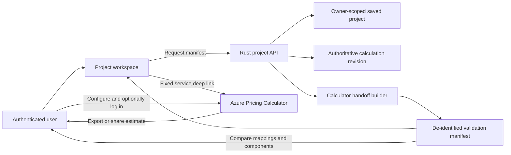

# Open in Azure Pricing Calculator research

Status: research recommendation, not an approved product or architecture change
Research date: 2026-08-23
Requested UI concept: a button beside `Share` that opens the current project's Azure mappings in the Azure Pricing Calculator

## Executive conclusion

The feature is useful, but the requested first-prize experience is not currently implementable as a supported production integration based on the public Microsoft contracts found in this research.

As of 2026-08-23:

- The Azure Pricing Calculator supports interactive product configuration and anonymous Excel export. Login is required for agreement pricing, Save, and Share.
- Microsoft documents a SQL Managed Instance service URL: `https://azure.microsoft.com/pricing/calculator/?service=sql-managed-instance`. In the live anonymous test, that URL still opened an empty estimate and did not add or configure SQL Managed Instance.
- No documented, supported public REST API, SDK, import format, or URL schema was found for creating, updating, or saving a fully configured Pricing Calculator estimate under the logged-in user's account.
- The documented Azure Retail Prices API returns public prices. It does not create calculator estimates.
- The authenticated Cost Management and Billing price-sheet APIs can return account-specific prices when the caller has the required billing access. They do not create calculator estimates.
- The application's existing Azure SQL calculator composition endpoint is a read-only pricing input and is explicitly treated by this repository as an unstable contract. It is not an estimate-write API.
- An anonymous Edge/Playwright trace found no functional estimate-write REST call. The site fetched pricing composition with GET, calculated in the browser, and persisted the working estimate in same-origin IndexedDB.

The recommended path is therefore:

1. Implement a fixed calculator link plus a server-authored, de-identified validation manifest and guided reconciliation workflow. Do not claim that the current service query preselects SQL Managed Instance.
2. Ask the Azure Pricing Calculator product owner whether a supported estimate-create/import API or partner handoff contract exists outside public documentation.
3. Optionally build an isolated local Playwright harness for synthetic or explicitly approved de-identified mapping regression tests and anonymous Excel export. Keep it outside the production runtime and user authentication flow.
4. Upgrade to automatic account-scoped estimate creation only if Microsoft supplies a supported, versioned contract, an approved authentication model, support commitments, and permission to send the required project data.

Do not build production functionality against private calculator endpoints, browser DOM automation, copied cookies, or reverse-engineered saved-estimate payloads.

## Decision summary

| Option | Meets fully configured estimate goal | Supportability | Complexity | Recommendation |
| --- | --- | --- | --- | --- |
| Open the documented SQL MI service URL | No; the live test opened an empty estimate | Supported navigation, but preselection is not reliable | Low | Use only as a fixed destination |
| Deep link plus guided validation manifest | Partially; configuration is manual but deterministic | Supported with repository approvals | Medium | Recommended feasible design |
| Public URL containing all configured rows | No documented URL contract was found | Unsupported/unknown | Medium initially, high ongoing | Do not implement |
| Calculator API using the logged-in user | No documented write API was found | Externally blocked | High/unknown | Conditional future option |
| In-app validation using account price sheets | Validates account rates but does not create a calculator estimate | Supported APIs exist | High | Separate optional feature |
| Isolated local Playwright validation harness | Yes for anonymous UI validation and Excel export | UI-dependent engineering tool, not a product contract | Medium with ongoing drift cost | Optional internal-only tool |
| Production browser service, extension, userscript, or RPA | Can fill the current UI in a controlled browser | Fragile, security-sensitive, and unapproved | High with unbounded maintenance | Reject for production |

## Terminology and scope

Microsoft documentation calls the calculator artifact an **estimate**, not a binding quote. The proposed button should use the official product name, preferably `Open in Azure Pricing Calculator`, unless product explicitly chooses different copy.

The calculator result remains an estimate rather than a Microsoft quote, price guarantee, licensing determination, capacity promise, or deployment approval. A saved or shared calculator estimate does not establish Azure Hybrid Benefit eligibility, reservation entitlement, negotiated discount eligibility, tax treatment, or contractual price.

This research covers workload projects that map EC2, RDS, or on-premises SQL Server resources to Azure SQL Managed Instance. The `sql_payg` project type does not produce SQL MI target line items and should be out of scope unless a separate calculator product mapping is designed.

## Evidence from current Microsoft surfaces

### Azure Pricing Calculator

The official calculator guide documents the following capabilities:

- An estimate is a collection of configured Azure products.
- A user adds products and configures region, tier, size, usage, and pricing plan interactively.
- Login enables negotiated or discounted agreement prices for supported billing relationships.
- Advanced actions include Export, Save, Save as, and Share.
- Share creates a unique link; only the owner can modify the estimate.
- Microsoft directs programmatic pricing-data consumers to the Azure Retail Prices API.

The guide does not document an estimate creation API, an import endpoint, an import file schema, or a general URL serialization format for configured estimates.

The SQL Managed Instance documentation uses this service-level deep link:

```text
https://azure.microsoft.com/pricing/calculator/?service=sql-managed-instance
```

That is evidence for navigating to the calculator. In the 2026-08-23 live test, the exact service query remained in the address bar but the page displayed `Empty estimate`; the user still had to search for and add Azure SQL Managed Instance. It is not evidence that arbitrary query parameters can configure region, SKU, quantity, memory, storage, purchase option, multiple rows, ownership, or saved-estimate state.

### Anonymous browser and network spike

A disposable Playwright script used the repository's existing `@playwright/test` package and workstation-installed Microsoft Edge in an isolated, anonymous browser context. It used only synthetic SQL MI values. No login was attempted; cookies, response bodies, request bodies, credentials, tokens, and stored values were not captured. Network records contained only method, sanitized origin/path, query-parameter names, resource type, status, content type, and payload byte count.

Observed behavior on 2026-08-23:

1. Initial page load made seven calculator-data GETs on `azure.microsoft.com`: support pricing, categories, regions, product resources, anonymous user information, currencies, and calculator configuration.
2. Searching for `SQL Managed Instance` was client-side and made no additional functional fetch/XHR call.
3. Adding Azure SQL Managed Instance made one GET to `/api/v3/pricing/azure-sql/calculator/` and rendered the full configuration form.
4. Changing region, service tier, hardware, vCores, redundancy, quantity, purchase option, SQL license option, data storage, and backup storage made no additional functional calculator request. The displayed values and totals changed in the browser.
5. Adding a second SQL MI line item reused the loaded composition and made no additional functional calculator request.
6. Anonymous Export was enabled and produced `ExportedEstimate.xlsx`; no functional estimate-create or export request was observed. Save and Share were rendered but disabled until login.
7. The site persisted the working estimate in IndexedDB database `localforage`, object store `keyvaluepairs`, under keys `azure_calculator_v3_estimates` and `azure_calculator_v3_active_estimate_id`. Configuration changes caused repeated `put` operations. Reloading the page and opening the URL in another tab in the same browser context both restored two line items.
8. The stable local-storage value and `history.state` did not change with the estimate. No Cache Storage or service worker was present in the tested context.
9. The all-origin fetch/XHR trace also observed analytics or experience telemetry POSTs to Microsoft OneCollector, Application Insights, and Microsoft Clarity, plus unrelated chat/experience configuration reads. Payloads were not inspected. No non-telemetry estimate-write endpoint was observed.

These are observations of the current website, not a supported API or storage contract. The endpoint versions, DOM names, IndexedDB schema, telemetry, and anonymous behavior can change without notice.

The spike changes the implementation assessment in four ways:

- REST replay is not a path to anonymous estimate creation because the functional calculator traffic was read-only; browser code created and persisted the estimate locally.
- A normal TCO Calculator page cannot populate that state. The same-origin policy prevents application JavaScript from reading or writing `azure.microsoft.com` DOM or IndexedDB state, even when it opens the destination with `window.open`.
- A local browser automation process can add and configure repeated line items and export the result through the current UI. It must drive documented user-visible controls rather than inject private IndexedDB records.
- The anonymous result is bound to that browser origin and context. Without login, Share is disabled, so a server-run browser cannot return a durable calculator URL to the user's browser; it can return only an export artifact or keep its own interactive browser session open.

### Azure Retail Prices API

The Retail Prices API is an unauthenticated read API for public retail rates by service, region, SKU, meter, and currency. Microsoft describes it as a way to build internal analysis and price-comparison tools.

It does not expose calculator estimate CRUD operations. It cannot attach data to the user's Pricing Calculator account. It also does not return the customer's negotiated agreement prices.

### Account-specific price sheets

Azure Cost Management and Billing expose authenticated price-sheet operations for supported EA, MCA, MPA, and related billing scopes. These APIs require Microsoft Entra authentication and appropriate billing permissions. They return prices for a billing scope; they do not save an Azure Pricing Calculator estimate.

These APIs could support a separate `Validate with my agreement prices` feature. That would be a materially different identity, authorization, privacy, and data-handling project.

### Existing application pricing inputs

The current application already resolves SQL MI rates from:

- Azure Retail Prices API.
- The public Azure SQL calculator composition endpoint at `https://azure.microsoft.com/api/v3/pricing/azure-sql/calculator/`.

The repository specification explicitly says the composition endpoint is not a stable contract and must remain behind the pricing-provider abstraction. It supplies rate composition for eight purchase options; it does not create or persist a user estimate.

This also limits the independence of the proposed validation. The Pricing Calculator and this application share upstream pricing data. Comparing them is still valuable for detecting mapping, quantity, term, memory, storage, licensing, and formula mistakes, but it is not a wholly independent price oracle.

## Current application fit

The proposed UI location is clear: the authenticated saved-project toolbar in `web/src/lib/components/ProjectWorkspace.svelte`, beside the existing `Share` action.

The browser must not build financial line items independently. The server-calculated revision is authoritative and already provides, per resource:

- Mapping and pricing status.
- Azure region, service tier, hardware family, vCores, included memory, selected memory, and storage architecture.
- Quantity, annual hours, Azure storage, and MI purchase option.
- Gross and net compute, additional memory, SQL license, and storage components.
- Formula version, Azure price snapshot identifier, explanation values, and pricing provenance.

This is enough to build a deterministic validation manifest without moving financial logic into TypeScript.

One likely contract gap must be checked during implementation: `TargetCandidate` contains `zone_redundant`, while the serialized `SelectedTarget` currently does not. If the calculator configuration exposes zone redundancy, the backend must return the selected value explicitly from the reviewed capability catalog. The frontend must not infer it by parsing `configuration_key`.

## Why headline totals may not match

The application and calculator can represent different commercial layers. A validation workflow must compare like with like.

The application calculates these Azure layers:

1. Gross public compute for the selected purchase option.
2. Gross additional memory.
3. Gross SQL license, including zero when AHB applies.
4. Gross data storage.
5. Project-entered Azure compute, license, and storage discounts.
6. A separate selected portfolio parity adjustment.

The Pricing Calculator can show retail or eligible agreement pricing and supported purchase plans. It does not necessarily reproduce the application's three manually entered component discounts or its final parity adjustment.

Validation should therefore have two explicit checkpoints:

- **Mapping and public-price checkpoint:** compare calculator configuration and gross components against the application's gross pre-discount components.
- **Commercial-reconciliation checkpoint:** explain agreement pricing and application-entered discounts separately, then reconcile to `total_before_parity`. Never treat the selected parity adjustment as an Azure rate.

For account pricing, the calculator user must log in and select the correct licensing program and billing scope. A browser session on `azure.microsoft.com` is independent from this application's Container Apps authentication session. The application must not transfer, capture, or reuse calculator cookies or access tokens.

## Recommended design: guided calculator handoff

### User experience

Add `Open in Azure Pricing Calculator` beside `Share` for authenticated, saved workload projects.

Enable the action only when all of the following are true:

- The saved project has a latest calculation revision.
- The current editor is not dirty.
- Relevant rows are mapped and have usable Azure prices.
- The Azure snapshot and formula version are present.
- The project type is supported.

For stale-but-usable prices, prefer `Refresh prices and recalculate` before handoff. If product allows stale validation, show the retrieval time prominently because the live calculator can have newer rates.

On activation:

1. Request a validation manifest derived from the persisted project and authoritative revision.
2. Show the grouped calculator line items, exclusions, assumptions, and expected gross components in an in-app dialog.
3. Let the user download an Excel-compatible CSV or JSON copy locally.
4. Open the fixed Microsoft URL in a new tab with `rel="noopener noreferrer"`.
5. The user signs in to the calculator if agreement pricing is required, adds/clones the grouped rows, and applies the manifest values.
6. The user exports or shares the resulting calculator estimate and compares it with the manifest.

The button must not imply that the calculator was auto-populated when it was not. The dialog should describe the handoff state plainly.

### Architecture



Use a small backend-owned handoff builder rather than placing calculator mapping logic in the Svelte component or calculation engine. It should consume existing project and revision types and emit a provider-facing validation DTO. Keep it separate from the financial formulas.

If Microsoft later provides a supported write API, add an adapter behind the handoff boundary. The calculation and target-selection modules should not depend on the calculator API.

### Proposed API shape

A possible read-only endpoint is:

```http
GET /api/v1/projects/{project_id}/azure-calculator-validation
If-None-Match: optional project ETag
```

The exact method and concurrency headers should be settled with the API design. The response should use `Cache-Control: no-store` and be represented in `openapi/openapi.yaml` before generating frontend types.

Suggested response concepts:

```json
{
  "calculator_url": "https://azure.microsoft.com/pricing/calculator/?service=sql-managed-instance",
  "generated_at": "date-time",
  "formula_version": "string",
  "azure_snapshot_id": "opaque string",
  "snapshot_retrieved_at": "date-time",
  "currency": "USD",
  "groups": [],
  "excluded_rows": [],
  "reconciliation": {},
  "warnings": []
}
```

The sample is conceptual, not an approved contract.

### Grouping and mapping contract

Combine resources only when all calculator-relevant values are identical. Sum quantity only after exact grouping. A grouping key should include at least:

- Azure region.
- SQL MI deployment/product type.
- Service tier.
- Hardware family.
- vCores.
- Included, selected, and additional memory.
- Storage architecture and zone-redundancy selection when applicable.
- Data storage GB per instance.
- Annual or calculator-equivalent monthly hours.
- Purchase option, reservation term, savings-plan term, and AHB selection.

Use neutral names such as `Validation group 001`. Do not send project names, workload names, server names, source SKUs, tenant IDs, owner IDs, or customer identifiers to the calculator.

| Application value | Calculator concept | Reconciliation note |
| --- | --- | --- |
| `settings.azure_region` | Region | Must use the calculator's exact region label/slug |
| `selected.service_tier` | Service tier | Only Next Generation General Purpose and Business Critical are valid here |
| `selected.hardware_family` | Hardware | Must match a currently offered calculator option |
| `selected.vcores` | vCores | Derived target output, not a client-editable app input |
| `selected.selected_memory_gb` | Selected memory | Additional memory must be charged exactly once |
| `storage_inputs.azure_storage_gb_per_instance` | Data storage | Backup storage is outside the current app formula unless separately added |
| `resource.quantity` | Instance quantity | Group only identical configurations |
| `annual_hours_per_instance` | Usage hours | Monthly conversion and rounding need an approved rule |
| `mi_purchase_option` | PAYG/reservation/savings plan and AHB | Entitlement remains a separate user decision |
| Gross component results | Calculator component costs | Primary comparison surface |
| App component discounts | Custom reconciliation | Do not assume calculator agreement prices equal these values |
| Selected parity adjustment | No calculator equivalent | Show separately and exclude from calculator-rate validation |

### Data minimization

The first guided version should not send line-item data from the application to Microsoft. It should open only the fixed service deep link. The user can then enter the de-identified values into the calculator as an explicit action.

The local manifest can contain target configuration, quantities, and expected values, but it should exclude source inventory and identity data unless a documented need is approved. Apply the same spreadsheet formula-injection hardening used by the existing CSV export.

No server-side manifest persistence is needed initially. Generate it from the owner-scoped saved project and revision, return it with `no-store`, and log only sanitized status, row counts, and timing.

## Conditional design: supported estimate-create API

Automatic creation should be considered only after Microsoft confirms all of the following in writing or in public documentation:

- A supported estimate-create/import operation exists.
- The operation supports SQL Managed Instance and all required configuration fields.
- The request and response schemas are versioned.
- The API can create an estimate owned by the delegated user.
- Required delegated scopes, consent, billing permissions, tenant behavior, and supported account types are documented.
- Rate limits, idempotency, error semantics, data retention, data residency, and support lifecycle are documented.
- Use by this application is permitted under applicable terms.

If those conditions are met, the likely flow is:

1. The user explicitly selects `Create calculator estimate`.
2. The backend revalidates ownership, ETag/revision, freshness, and row eligibility.
3. A server-side adapter converts the handoff manifest to the supported calculator request.
4. The adapter calls the API with a least-privilege delegated user token or another model expressly required by the API.
5. The backend never persists or logs access tokens, cookies, commercial price sheets, or full request payloads.
6. The API returns an immutable estimate identifier or URL.
7. The browser opens that returned URL on the Microsoft origin.

The current application receives platform-validated principal claims and does not store or forward access tokens. Identity-header claims alone cannot authorize an arbitrary downstream calculator API. Any delegated-token design would require a fresh Entra architecture review and cannot be assumed from the existing login.

Use idempotency keyed to the project revision so retries do not create duplicate estimates. Keep the provider adapter fail-closed: if a calculator field cannot be represented exactly, return a structured unsupported-mapping result rather than silently changing the configuration.

## Alternative: validate with account price sheets inside the app

If the real outcome is validating rates rather than producing a saved calculator artifact, an in-app account-price validator may be more supportable than calculator automation.

Potential flow:

1. Obtain explicit delegated authorization for a supported billing scope.
2. Read the applicable price sheet through the documented Billing or Cost Management API.
3. Match the authoritative target configuration to price-sheet meters on the server.
4. Calculate a separate account-price comparison without changing the original public-price revision.
5. Show public estimate, account-price estimate, exclusions, meter identifiers, and provenance side by side.

This is not a small extension. Billing scopes and permissions vary by agreement type, the data is commercially confidential, and the repository currently does not forward user tokens or ingest customer commercial agreements. It requires separate architecture, Security, Privacy, authorization, and specification approval.

It also does not create a Pricing Calculator estimate, so it should not be presented as fulfilling the requested first-prize behavior.

## Revised option: local Playwright validation harness

The spike proves a Selenium-style workflow is technically feasible as an engineering tool. It does not make that workflow suitable for the production application.

An approved internal harness could:

1. Accept a bounded, target-only validation manifest generated from synthetic fixtures or explicitly approved de-identified project data.
2. Launch a pinned, isolated Edge context without loading a person's browser profile, cookies, tokens, or calculator login.
3. Open the fixed calculator URL, search for Azure SQL Managed Instance, and add one item per exact manifest group.
4. Scope selectors to each estimate item and set region, tier, hardware, vCores, redundancy, quantity, hours, purchase option, AHB choice, storage, and approved backup assumptions.
5. Assert every rendered selection and item count before accepting the result.
6. Export the anonymous workbook and compare its mapping and gross components with frozen synthetic expectations or an approved local manifest.
7. Record only sanitized endpoint metadata, browser version, calculator UI signature, test time, and pass/fail results.
8. Fail closed when a product, selector, option, or output cannot be represented exactly.

The harness must not write IndexedDB directly. The observed keys are private implementation details, and injecting serialized state would be more brittle than exercising the UI. It also must not launch with a user's regular Edge profile or attempt calculator login; that would expose browser data and turn the tool into a credential-bearing integration.

Repeated line items worked in the spike, so all grouped project mappings are mechanically possible when every target has a calculator equivalent. Practical limits still need tests: the application allows up to 100 resources, the calculator may become slow with many ungrouped rows, selectors repeat across items, and optional calculator costs can diverge from the application. Exact grouping remains essential.

This harness would validate mappings but would not implement the requested web-product experience. For a user to inspect the live estimate, the automation must run on that user's machine and keep its isolated headed browser context open. Shipping such a companion executable, VS Code-only command, browser extension, or remote-debugging workflow requires separate product scope, software approval, threat modeling, support ownership, and data-egress approval.

## Rejected production approaches

### Private or reverse-engineered calculator endpoints

The public website necessarily uses internal services for session and estimate behavior, but an observable browser call is not a supported product API. Depending on it would create an unapproved external API, unstable schema, uncertain terms, cookie/anti-forgery coupling, and no support commitment.

The repository already treats the public pricing composition endpoint as unstable even though it is unauthenticated and read-only. A private authenticated write endpoint would carry substantially greater security and operational risk.

### Encoding the project in an undocumented URL

No supported serialization schema was found. Even if an undocumented payload currently works, URLs can leak through browser history, logs, proxies, support captures, and copied links. Project and customer data must not be placed in a URL.

### Headless browser or RPA using the user's account

Server-side Playwright/Selenium cannot safely borrow the user's browser session. Asking for cookies, tokens, or credentials is prohibited. Running a remote interactive browser would add another runtime, customer-data flow, attack surface, and fragile dependency on calculator DOM details.

It would also violate the currently approved minimal runtime image, which contains only the Rust binary, built web assets, and CA certificates. A browser runtime, browser binaries, profile storage, download storage, or additional worker/container requires a specification change and written dependency, architecture, Security, Privacy, and operations approval.

### Browser extension or userscript

An extension could technically fill form controls in the user's browser, but it would require separate software approval, distribution, permissions, update support, and DOM-specific maintenance. It is not appropriate for the MVP web application and should not be a hidden prerequisite for the button.

## Security, privacy, and compliance requirements

Any implementation must preserve these repository controls:

- Fixed allowlisted HTTPS destination owned by Microsoft.
- External navigation with `noopener` and `noreferrer`.
- No credentials, access tokens, identity headers, cookies, capability secrets, or owner identifiers in URLs, manifests, telemetry, or provider calls.
- Server-side ownership and object-level authorization for the saved project.
- Server-authoritative mapping and financial values.
- Bounded manifest size consistent with the 100-resource project limit.
- `Cache-Control: no-store` for project-derived responses.
- Sanitized errors that do not include upstream response bodies or project payloads.
- No project or workload names in logs or calculator configuration names.
- No assumption that AHB, reservations, savings plans, discounts, or agreement access establish customer entitlement.
- No direct read or write of the calculator's private IndexedDB schema.

The current `THIRD-PARTY-DATA-EGRESS.md` says the application never sends quantities, customer inventories, totals, subscription identifiers, or commercial agreements to pricing providers. An automatic handoff containing configured rows would change that statement. Before such a flow is implemented, document the purpose, exact fields, destination, authentication, retention, user choice, and accountable owner, then obtain written Privacy, Security, architecture, and service-owner approval.

A plain service deep link sends no project payload and can fit the current egress boundary. A local validation manifest also avoids automatic provider disclosure.

The public calculator page itself was observed sending analytics/experience telemetry to Microsoft-operated collection endpoints and loading chat/experience configuration. Opening the external page therefore leaves this application's origin and privacy boundary even when the TCO Calculator sends no project payload. Any automated harness must document this observed egress and must not claim that UI-entered fields remain only in local browser storage merely because no functional estimate-write REST call was observed.

## Validation method

The feature itself needs a reproducible validation protocol.

### Retail mapping validation

1. Refresh Azure prices and calculate the project.
2. Record formula version, snapshot identifier, retrieval time, and source URLs.
3. Generate grouped target-only line items.
4. Open the calculator without selecting account agreement pricing.
5. Configure every group using the manifest.
6. Set unrelated calculator components, such as backup, networking, support, or other optional services, to zero or exclude them where possible.
7. Compare region, tier, hardware, vCores, memory, data storage, quantity, hours, plan, and AHB selection.
8. Compare gross compute, license, additional-memory, and storage components before app-specific discounts.
9. Reconcile display rounding and price-effective timing explicitly.
10. Save both the app export and calculator export as test evidence under approved confidential-data controls, not in the repository.

### Agreement-price validation

1. The user logs in directly on the calculator origin.
2. The user selects the correct licensing program and authorized billing account/profile.
3. The same target mappings are entered.
4. Agreement results are labeled separately from the application's public-list results.
5. Differences are not called defects unless the application was intentionally configured with the same agreement rates and commercial assumptions.

### Acceptance criteria to define before build

- Which calculator fields must match exactly.
- Which totals are compared: gross, net before parity, monthly, annual, upfront, or term-amortized.
- How annual hours map to calculator monthly units.
- How reservation upfront and recurring components are annualized.
- Allowed absolute and percentage tolerance after display rounding.
- How price changes between snapshot retrieval and calculator use are handled.
- Whether stale snapshots block the action.
- Whether partially mapped projects may export only valid groups or must fail as a whole.
- Whether calculator export evidence is retained and by whom.

Do not choose tolerances merely to make a test pass. Derive them from calculator precision, export precision, rate effective dates, and the application's decimal rounding boundaries.

## Complexity assessment

The estimates below are rough engineering ranges for one experienced engineer, excluding external Microsoft response time, formal review queues, and deployment scheduling.

| Scope | Indicative effort | Main work | Principal risk |
| --- | --- | --- | --- |
| Static SQL MI service link | 1-2 engineering days | Button, link security, visibility rules, UI test | Users may assume it is preconfigured |
| Guided manifest and manual calculator handoff | 2-4 engineering weeks | OpenAPI contract, Rust mapper, grouping, CSV/JSON rendering, dialog, tests, docs, privacy review | Manual entry and calculator UI drift |
| Internal anonymous Playwright validation harness | 2-4 engineering weeks | Manifest reader, item-scoped UI automation, browser pinning, export verification, drift diagnostics | UI/schema drift and limited independence from shared pricing inputs |
| Supported calculator write/import API | 6-12+ engineering weeks after contract access | Identity, consent, adapter, idempotency, reconciliation, failure handling, security testing | API may not exist or may not support required account types/fields |
| In-app account price-sheet validation | 4-8+ engineering weeks | Delegated billing access, agreement variants, meter matching, confidential-data controls | Permissions and agreement-specific semantics |
| Production browser automation/extension | 2-6 weeks for a prototype; unbounded maintenance | DOM automation, distribution/session handling, browser/profile lifecycle | Unsupported, fragile, security-sensitive |

The guided handoff is medium complexity because accurate grouping, provenance, exclusions, and reconciliation are more important than rendering the button. The fully automatic option is externally blocked, so its calendar duration cannot be estimated responsibly until a contract is available.

## Execution plan if the feature is approved

### Phase 0: resolve the go/no-go questions

1. Ask the Azure Pricing Calculator product team or account team for a supported estimate-create/import API, schema, auth model, terms, and support lifecycle.
2. Confirm whether the product goal requires automatic population or whether deterministic guided validation is acceptable.
3. Define retail versus agreement-price validation and exact acceptance tolerances.
4. Decide whether target quantities may be disclosed to Microsoft and whether configuration names must remain anonymous.
5. Record written Product, architecture, Security, Privacy, and service-owner decisions.
6. Update the authoritative specification before implementation.

Decision gate:

- If no supported write/import contract exists, proceed only with the guided handoff.
- If a supported contract exists, review it before choosing identity or changing application data flow.

### Phase 1: build the guided handoff

1. Add the handoff behavior and exclusions to `research/Azure Specification.md`.
2. Update `THIRD-PARTY-DATA-EGRESS.md` and the privacy notice if the approved flow changes disclosure.
3. Define the validation DTO and endpoint in OpenAPI; regenerate TypeScript types.
4. Implement the Rust handoff builder over existing domain and calculation-revision types.
5. Add exact grouping and de-identification tests.
6. Add authorization, dirty/stale/unmapped, no-store, size-bound, and sanitized-error tests.
7. Add the Svelte button and a focused validation dialog beside `Share`.
8. Use the fixed SQL MI service deep link and secure external-link attributes.
9. Add frontend unit and Playwright coverage for enabled, disabled, warning, keyboard, focus, popup-blocked, and download states.
10. Validate representative EC2, RDS, and on-prem fixtures against calculator exports manually.
11. Document known differences for backup storage, support, taxes, network, arbitrary discounts, agreement pricing, and parity adjustments.

### Phase 2: add automatic estimate creation only if supported

1. Threat-model delegated identity, token handling, cross-tenant behavior, and object authorization.
2. Obtain approval for the exact external API, scopes, dependencies, and data fields.
3. Add a narrow provider adapter behind the existing handoff boundary.
4. Pin the supported API version and validate every outgoing enum/value.
5. Add idempotency, bounded retries, timeouts, rate-limit handling, and fail-closed mapping behavior.
6. Return only the supported calculator estimate identifier/URL to the browser.
7. Test with Microsoft-provided nonproduction facilities or approved synthetic accounts across supported agreement types.
8. Add feature flags, sanitized operational telemetry, rollback, and contract-drift monitoring.
9. Run security, privacy, accessibility, API, end-to-end, and manual calculator parity reviews before release.

### Optional internal track: anonymous UI validation harness

1. Obtain written approval for the exact internal use, target-only fields, Microsoft destinations, exported artifact handling, browser dependency, and accountable owner.
2. Keep the harness out of the production image and application request path.
3. Start with frozen synthetic EC2, RDS, and on-prem mapping fixtures; do not use customer projects during development.
4. Consume the same backend-authored validation DTO proposed for the guided handoff rather than duplicating mapping logic in JavaScript.
5. Pin Playwright and the approved Edge channel/version, and record the calculator UI signature used by each run.
6. Add items and configure controls through accessible labels and item-scoped selectors; never inject IndexedDB state or execute copied site code.
7. Verify every selected field, component total, aggregate total, and exported workbook before passing.
8. Treat missing controls, changed labels/options, unexpected functional writes, download changes, or telemetry-origin changes as review-required drift.
9. Delete isolated browser state and temporary exports after the approved evidence-retention period.

## Questions requiring clarification

### Product outcome

1. Is the guided manifest acceptable when automatic calculator population is unavailable?
2. Is the required artifact a saved calculator **estimate**, or is there a separate formal sales quote requirement?
3. Should the button use the official label `Open in Azure Pricing Calculator`?
4. Is the primary goal mapping validation, retail-price validation, agreement-price validation, or all three as separate modes?
5. Must the action be limited to authenticated saved projects, or should guests receive a local-only handoff too?

### Mapping and comparison

6. Should identical target mappings be grouped to reduce calculator rows, or must every source workload remain a separate calculator item?
7. May any project/workload label be disclosed, or must calculator item names always be anonymous?
8. Should partially mapped projects export valid groups with exclusions, or block the entire action?
9. Must stale-but-usable price snapshots block validation?
10. What is the approved conversion from annual hours to the calculator's monthly usage control?
11. How should reservation upfront and recurring costs be normalized for comparison?
12. Which backup-storage, redundancy, networking, and support assumptions must be set in the calculator?
13. Which app discounts must be zero for retail validation, and how should nonzero discounts be reconciled?
14. What absolute/percentage tolerance is acceptable, and at which rounding boundary?
15. Should the app support only USD, matching the current project contract, even when the calculator can display another currency?

### Identity and ownership

16. Which agreement types must work: MCA, EA, CSP, MOSA, or a defined subset?
17. Who will obtain a written answer from the Azure Pricing Calculator product owner about supported create/import APIs?
18. If a delegated API exists, can the Entra application registration and current Container Apps authentication design be changed?
19. Is a user consent prompt acceptable for calculator-specific delegated scopes?
20. Should a calculator share URL be stored back on the project? If yes, what retention, validation, authorization, and revocation behavior is required?

### Governance and evidence

21. Is sending anonymous target quantity/configuration data to Microsoft approved, or must the first release remain manual-entry only?
22. Who may retain the calculator Excel export and comparison evidence, where, and for how long?
23. Does validation evidence need an opaque manifest hash or revision identifier for auditability?
24. What is the release gate when the calculator UI or product catalog no longer represents an application target exactly?

### Automation boundary

25. Is an internal anonymous UI-validation harness desired, even though it cannot create a saved or shared estimate in the user's account?
26. May that harness process approved de-identified project manifests, or must it remain limited to frozen synthetic fixtures?
27. Is an exported workbook sufficient, or must a user continue interacting with the live estimate in the same local browser context?
28. Who owns Edge/Playwright pinning, calculator UI drift response, temporary export retention, and operational support?
29. Is a separately installed local companion tool in scope for future review, or must all deliverables remain inside the current web application and container topology?

## Go/no-go recommendation

**Go** for a discovery spike with the calculator product team and for the guided deep-link plus validation-manifest design, subject to the specification and privacy/egress approvals above.

**Go, internal only** for a bounded anonymous Playwright validation harness using frozen synthetic fixtures first, with explicit approval before processing any project-derived manifest.

**No-go** for automatic estimate creation until a supported public or partner contract is produced and reviewed.

**No-go** for production use of private endpoints, copied browser sessions, undocumented URL payloads, headless browser automation, or DOM-filling extensions.

## Primary sources

All sources were reviewed on 2026-08-23.

1. [Azure Pricing Calculator](https://azure.microsoft.com/en-us/pricing/calculator/)
2. [Estimate costs with the Azure pricing calculator](https://learn.microsoft.com/azure/cost-management-billing/costs/pricing-calculator)
3. [Azure Retail Prices API](https://learn.microsoft.com/rest/api/cost-management/retail-prices/azure-retail-prices)
4. [Cost Management automation overview](https://learn.microsoft.com/azure/cost-management-billing/automate/automation-overview)
5. [View and download your organization's Azure pricing](https://learn.microsoft.com/azure/cost-management-billing/manage/ea-pricing)
6. [Migrate Cost Management APIs: price-sheet operations](https://learn.microsoft.com/azure/cost-management-billing/costs/migrate-cost-management-api#price-sheet-apis)
7. [Azure SQL Managed Instance automated backups: documented calculator deep link](https://learn.microsoft.com/azure/azure-sql/managed-instance/automated-backups-overview?view=azuresql#backup-retention)

Absence finding: the first-party sources above document interactive estimates, save/share/export, retail price reads, and account price-sheet reads. No supported calculator estimate-write/import contract was located. Because absence from public documentation cannot prove that no private partner program exists, Microsoft product-team confirmation remains the required external decision step.