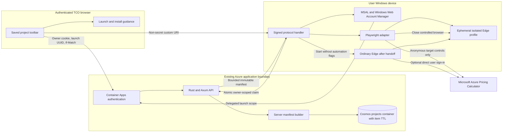
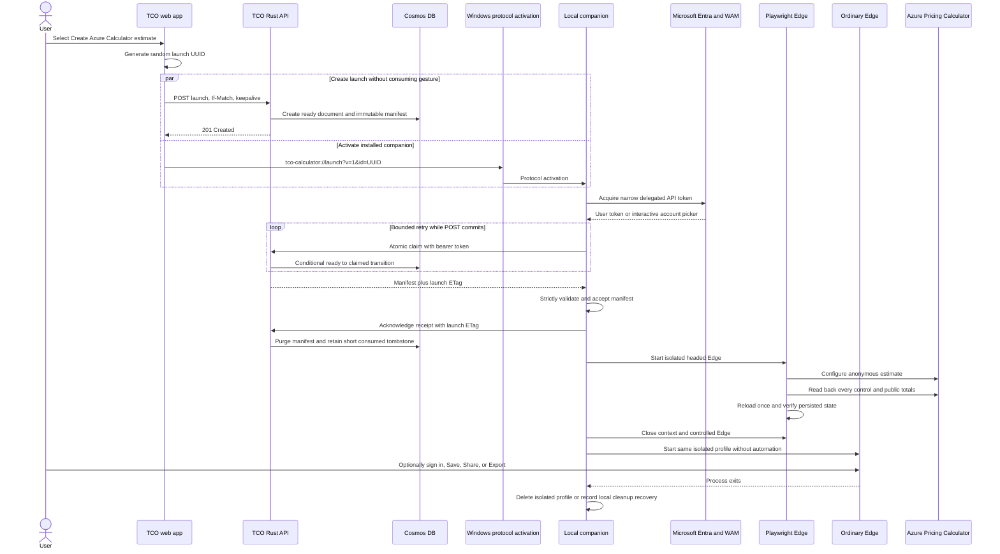
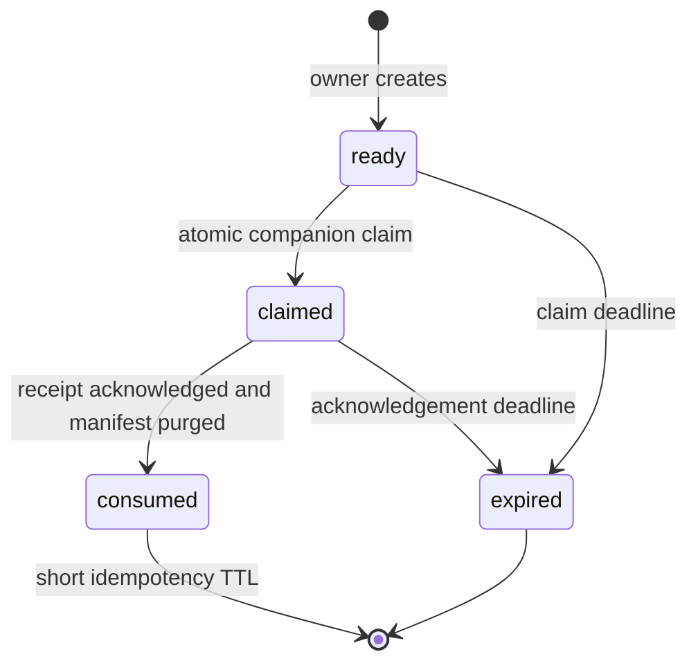

# Azure Pricing Calculator local companion implementation handoff

Status: **ALL LISTED AUTHORITIES APPROVED - IMPLEMENTATION PHASE GATES APPLY**

Research and plan date: 2026-08-23

Target implementer: GitHub Copilot coding agent using GPT-5.6 Sol with high reasoning

Requested outcome: an authenticated user clicks `Create Azure Calculator estimate` beside `Share`; a separately installed Windows companion opens an isolated visible browser on that user's laptop, uses Playwright to populate the current server-authoritative Azure SQL Managed Instance estimate, verifies every configured control, stops making browser automation calls, and leaves the browser open so the user may sign in to Microsoft and manually Save or Share.

> This document is the approved implementation handoff. On 2026-08-23, the repository owner stated that they hold or have delegated authority for Product, Architecture, Identity, Security, Privacy, Legal/Terms, Legal/OSS, Endpoint/Signing, and Operations, and approved every decision and review question recorded below. Exact dependency, tool, signing-artifact, validation, CI, environment, and deployment controls remain mandatory and are not waived by this approval.

## Executive conclusion

The requested attended workflow is technically feasible, but it is not implementable by the hosted web application alone. It requires a separately installed and signed local application with a registered Windows URI protocol, a narrowly scoped authenticated rendezvous with the existing Rust API, and a headed Playwright browser session that remains owned by the companion until the user closes it.

The selected reference architecture is:

1. The authenticated browser validates that the saved project is clean and calculated, generates a random launch UUID, starts an owner-authorized launch-request `POST` without awaiting it, and invokes a fixed custom URI containing only that non-secret UUID while the original user gesture is still active.
2. The existing Rust API reloads the project by server-derived `tid` plus `oid`, requires the current ETag, validates the persisted calculation revision and price state, and stores a short-lived launch document in the existing Cosmos `projects` container.
3. A signed Windows companion registered for the custom URI authenticates to the TCO API as a public native client through Microsoft Entra and Windows Web Account Manager. It requests only one narrow delegated scope. It never receives the web session cookie and never receives a Calculator token.
4. The API verifies the companion scope, authorized client application, tenant, object ID, launch ownership, expiry, ETag, and claim idempotency before returning a bounded, server-authored manifest with `Cache-Control: no-store`.
5. The companion launches a new visible Playwright-controlled Edge process with a unique app-owned profile directory. It never attaches to the user's normal browser profile, writes Calculator IndexedDB directly, captures storage state, or records credentials.
6. The companion fills and reads back every supported Calculator control. Mapping mismatches fail closed. After successful verification it closes the Playwright context and controlled Edge process, waits for the profile to be released, and starts ordinary Edge against that same isolated profile with no Playwright connection or remote-debugging transport.
7. Only after the ordinary browser is running does the companion enter `handed_off`. The user may then sign in directly on Microsoft's page and manually Save or Share. The companion waits only on the browser process so it can remove the isolated profile after exit; it makes no DOM, network, storage, screenshot, trace, URL, or page-content calls after handoff.
8. The TCO application and companion do not automate sign-in, inspect credentials, capture tokens or cookies, click Save/Share, or receive the resulting Calculator URL.

This architecture does **not** add Playwright, Node, a browser, or another runtime to the production Container App. It does add a separately distributed desktop product, a native-client Entra registration and delegated API scope, new short-lived Cosmos documents, and project-derived egress to the Microsoft Calculator page. Those are specification, identity, privacy, software-approval, and operations changes.

Two Phase 1 experiments can still disprove the design and therefore block all production implementation:

- **Activation gate:** the supported Edge versions and enterprise policies must preserve the user gesture while the page starts the launch request and invokes the custom protocol. If not, the approved UX must become a second explicit `Open companion` click.
- **Sign-in preservation gate:** a synthetic estimate populated anonymously in the isolated profile must survive the user's interactive Microsoft sign-in redirect in the same browser window. If it does not, this design stops; automation of an already authenticated Calculator profile is not an automatic fallback.

Private Calculator endpoints, undocumented estimate payloads, direct IndexedDB writes, copied browser sessions, password automation, MFA bypass, CAPTCHA or anti-automation evasion, and secrets or project data in activation URIs remain prohibited.

## Instructions to the next coding agent

Before changing source, the coding agent MUST:

1. Read `.github/copilot-instructions.md`, `FAMILY-DINNER.md`, `research/Azure Specification.md`, `THIRD-PARTY-DATA-EGRESS.md`, this document, and the recorded approval artifacts.
2. Verify that every `PENDING` value in the decision-answer block below has been replaced with an allowed value and that every required approval has an owner, decision date, and non-sensitive repository reference.
3. Stop and ask the repository owner if two answers conflict, an approval is absent, or an exact dependency/runtime/signing decision is not recorded. Silence is not approval.
4. Treat the implementation phases as ordered gates. Do not scaffold later phases while an earlier experiment or review gate is unresolved.
5. Use synthetic data until the Privacy and Security gates explicitly permit project-derived manifests. Never use customer names, tenant identifiers, credentials, commercial terms, or production data in fixtures, screenshots, traces, logs, prompts, or documentation.
6. Preserve the existing single-image Azure application topology. The companion is a separate installed product; it is never copied into the runtime container or deployed as another Container App, Job, sidecar, function, or browser service.
7. Keep Calculator automation anonymous. The companion MUST finish all Playwright reads and writes before the user is invited to sign in. After handoff it may wait only for browser disconnection; it MUST NOT inspect the page, URL, DOM, requests, responses, cookies, storage, downloads, or user input.
8. Use official supported platform APIs and packages. Do not hand-roll OAuth, JWT validation, cryptography, installer trust, browser drivers, or update signing.
9. Verify exact versions, publishers, package sources, licenses, transitive dependencies, vulnerabilities, installer URLs, and published hashes under the repository software policy before installing or restoring any new tool or package.
10. After the governance-only Phase 0 gate passes, make the first implementation commit a Phase 1 synthetic spike only. No production feature flag may be enabled until every later acceptance gate passes.

## Blocking owner decision register

The recommended value is a proposal, not an approval. `Required before` identifies the first phase that must stop without an answer.

| ID | Decision | Allowed answers | Recommended value | Required before |
| --- | --- | --- | --- | --- |
| `DEC-001` | Approve a separately installed Windows companion as a new product boundary and specification exception | `approve` / `reject` | `approve` | Any source change |
| `DEC-002` | Confirm the v1 outcome: populated local Calculator window, optional manual Microsoft sign-in, manual Save/Share, and no Calculator URL returned to TCO | `confirm` / `change` | `confirm` | API and UX design |
| `DEC-003` | Select the first supported client platform | `windows-10-1809-plus-server-2022-x64-owner-dev-demo` / `windows-11-x64-general` / other documented scope | `windows-10-1809-plus-server-2022-x64-owner-dev-demo` | Companion scaffold |
| `DEC-004` | Select the companion application stack | `dotnet-10-wpf` / `typescript-node-packaged` / another reviewed stack | `dotnet-10-wpf` using pinned .NET 10, Windows App SDK lifecycle APIs, Microsoft.Playwright, and MSAL.NET/WAM | Dependency review |
| `DEC-005` | Select the automated browser distribution | `installed-edge-stable` / `bundled-playwright-chromium` | `installed-edge-stable` with an isolated profile and tested version range | Browser spike |
| `DEC-006` | Approve the profile policy | `ephemeral-per-launch` only for the baseline; any persistent profile requires a new review | `ephemeral-per-launch`, deleted on normal close and startup cleanup | Browser spike |
| `DEC-007` | Select companion-to-TCO authentication | `entra-wam-delegated-scope` / `two-step-downloaded-manifest` | `entra-wam-delegated-scope`; no local listener, shared secret, copied cookie, or capability token in the URI | Identity spike |
| `DEC-008` | Select companion tenancy and consent | `multitenant-workforce` / `single-tenant-pilot` | `multitenant-workforce`, matching the web app; workforce accounts only | App registration |
| `DEC-009` | Select signing and distribution for the development demo | `owner-self-signed-msix-github-release` / `public-trust-msix-github-release` / `microsoft-store` | `owner-self-signed-msix-github-release`; GitHub identifies the release source but cannot provide a Windows Authenticode publisher certificate; the owner explicitly trusts the public development certificate before installing the MSIX | Packaging work |
| `DEC-010` | Select Calculator row identity and grouping | `anonymous-one-per-resource` / `source-name-one-per-resource` / `anonymous-exact-groups` | `anonymous-one-per-resource` with labels `Workload 001`, `Workload 002`, and so on | Manifest contract and Privacy approval |
| `DEC-011` | Select project eligibility policy | `all-rows-fresh-or-block` / `allow-valid-subset` / another exact rule | `all-rows-fresh-or-block`: saved, clean, latest revision, all rows mapped, fresh Azure prices, USD, supported project type | Manifest builder |
| `DEC-012` | Select validation behavior when Calculator prices differ but every control matches | `warn-and-handoff` / `block` | `warn-and-handoff`; configuration mismatch always blocks | Adapter acceptance tests |
| `DEC-013` | Select annual-to-monthly usage behavior | `exact-divide-by-12-or-block` / an explicitly documented rounding rule | `exact-divide-by-12-or-block`; Phase 1A must prove the Calculator accepts the required precision | Manifest contract |
| `DEC-014` | Select behavior if anonymous estimate state does not survive interactive Calculator sign-in | `stop-feature` / separately reviewed authenticated-profile automation | `stop-feature`; no silent fallback | End of Phase 1A |
| `DEC-015` | Select active-session and abandoned-profile limits | Exact lifecycle policy | One active session per OS user; 10-minute claim window; bounded anonymous automation; delete on ordinary Edge close and retry at next companion start; no wall-clock guarantee after a crash without a separately approved background task | Companion state machine |
| `DEC-016` | Select telemetry and result retention | Exact fields and duration | Ready/claimed ticket TTL is 10 minutes; acknowledged manifest is purged immediately; consumed idempotency tombstone retains only instance/version/timestamps for 24 hours; release companion logs no payloads, names, amounts, URLs, page content, or tokens | Persistence implementation |
| `DEC-017` | Approve compatibility and kill-switch behavior | `required` / `not-required` | `required`: server feature flag defaults off, exact manifest schema, minimum companion version, Calculator contract version, and fail-closed drift circuit | API implementation |
| `DEC-018` | Confirm v1 project scope | `authenticated-saved-workloads-only` / another exact scope | `authenticated-saved-workloads-only`: EC2, RDS, and on-premises; no guest or SQL PAYG launch | UX implementation |
| `DEC-019` | Decide the status of `docs/AZURE-CALCULATOR-AUTOMATION-APPROVAL-PROPOSAL.md` | `superseded-by-local-companion` / `retain-as-separate-option` | `superseded-by-local-companion`; do not implement its server-side browser job | Specification update |
| `DEC-020` | Set the release item cap | Integer `1..=100` backed by a timed synthetic test | `25`; block larger projects until soak evidence supports an increase | Manifest and UI implementation |
| `DEC-021` | Select progress ownership after protocol activation | `companion-only-no-web-polling` / `web-status-polling` | `companion-only-no-web-polling`; the server stores a one-time handoff ticket, not a job | API and UX design |

### Decision answers to complete before coding

Replace only the values and repository references. Do not put tenant IDs, client IDs, certificate details, private URLs, credentials, or customer information in this file.

```yaml
decision_answers:
  DEC-001: approve
  DEC-002: confirm
  DEC-003: windows-10-1809-plus-server-2022-x64-owner-dev-demo
  DEC-004: dotnet-10-wpf
  DEC-005: installed-edge-stable
  DEC-006: ephemeral-per-launch
  DEC-007: entra-wam-delegated-scope
  DEC-008: multitenant-workforce
  DEC-009: owner-self-signed-msix-github-release
  DEC-010: anonymous-one-per-resource
  DEC-011: all-rows-fresh-or-block
  DEC-012: warn-and-handoff
  DEC-013: exact-divide-by-12-or-block
  DEC-014: stop-feature
  DEC-015: one-active-session-10-minute-claim-delete-on-close-and-startup-recovery
  DEC-016: server-ticket-ttl-and-sanitized-aggregate-events-only
  DEC-017: required
  DEC-018: authenticated-saved-workloads-only
  DEC-019: superseded-by-local-companion
  DEC-020: 25
  DEC-021: companion-only-no-web-polling

approval_records:
  repository_owner: approved-all-decision-values-in-conversation-2026-08-23
  product: approved-by-authorized-user-in-conversation-2026-08-23
  architecture: approved-by-authorized-user-in-conversation-2026-08-23
  identity: approved-by-authorized-user-in-conversation-2026-08-23
  security_threat_model: approved-by-authorized-user-in-conversation-2026-08-23
  privacy_and_data_egress: approved-by-authorized-user-in-conversation-2026-08-23
  legal_and_calculator_terms: approved-by-authorized-user-in-conversation-2026-08-23
  oss_and_dependency_review: approved-by-authorized-user-in-conversation-2026-08-23
  desktop_packaging_and_code_signing: approved-by-authorized-user-in-conversation-2026-08-23
  operations_and_support_owner: approved-by-authorized-user-in-conversation-2026-08-23
```

The authorized user approved every decision value above and explicitly approved visible-control Playwright automation under the attended no-login-automation boundary, accepted the documented residual isolated-profile risk with the specified controls, and approved the multitenant public native client, WAM, single delegated API scope, and `tid` plus `oid` owner match. The approval covers architecture and implementation, anonymous synthetic testing, disabled-by-default development deployment, and a managed development pilot after its phase gates pass. It does not waive exact dependency review, immutable package/signature evidence, validation failures, current Calculator drift checks, or environment-specific deployment safeguards. If `DEC-007` changes from `entra-wam-delegated-scope`, the one-click architecture in this document no longer applies.

## Terminology and scope

Microsoft documentation calls the calculator artifact an **estimate**, not a binding quote. The proposed button label is `Create Azure Calculator estimate`; `Azure Pricing Calculator` should appear in the dialog and accessible description so users know that the action opens a separate Microsoft product.

The calculator result remains an estimate rather than a Microsoft quote, price guarantee, licensing determination, capacity promise, or deployment approval. A saved or shared calculator estimate does not establish Azure Hybrid Benefit eligibility, reservation entitlement, negotiated discount eligibility, tax treatment, or contractual price.

This research covers workload projects that map EC2, RDS, or on-premises SQL Server resources to Azure SQL Managed Instance. The `sql_payg` project type does not produce SQL MI target line items and should be out of scope unless a separate calculator product mapping is designed.

## Evidence from current Microsoft surfaces

### Azure Pricing Calculator

The official calculator guide documents the following capabilities:

- An estimate is a collection of configured Azure products.
- A user adds products and configures region, tier, size, usage, and pricing plan interactively.
- Login enables negotiated or discounted agreement prices for supported billing relationships.
- Advanced actions include Export, Save, Save as, and Share.
- Share creates a unique link; only the owner can modify the estimate.
- Microsoft directs programmatic pricing-data consumers to the Azure Retail Prices API.

The guide does not document an estimate creation API, an import endpoint, an import file schema, or a general URL serialization format for configured estimates.

The SQL Managed Instance documentation uses this service-level deep link:

```text
https://azure.microsoft.com/pricing/calculator/?service=sql-managed-instance
```

That is evidence for navigating to the calculator. In the 2026-08-23 live test, the exact service query remained in the address bar but the page displayed `Empty estimate`; the user still had to search for and add Azure SQL Managed Instance. It is not evidence that arbitrary query parameters can configure region, SKU, quantity, memory, storage, purchase option, multiple rows, ownership, or saved-estimate state.

### Anonymous browser and network spike

A disposable Playwright script used the repository's existing `@playwright/test` package and workstation-installed Microsoft Edge in an isolated, anonymous browser context. It used only synthetic SQL MI values. No login was attempted; cookies, response bodies, request bodies, credentials, tokens, and stored values were not captured. Network records contained only method, sanitized origin/path, query-parameter names, resource type, status, content type, and payload byte count.

Observed behavior on 2026-08-23:

1. Initial page load made seven calculator-data GETs on `azure.microsoft.com`: support pricing, categories, regions, product resources, anonymous user information, currencies, and calculator configuration.
2. Searching for `SQL Managed Instance` was client-side and made no additional functional fetch/XHR call.
3. Adding Azure SQL Managed Instance made one GET to `/api/v3/pricing/azure-sql/calculator/` and rendered the full configuration form.
4. Changing region, service tier, hardware, vCores, redundancy, quantity, purchase option, SQL license option, data storage, and backup storage made no additional functional calculator request. The displayed values and totals changed in the browser.
5. Adding a second SQL MI line item reused the loaded composition and made no additional functional calculator request.
6. Anonymous Export was enabled and produced `ExportedEstimate.xlsx`; no functional estimate-create or export request was observed. Save and Share were rendered but disabled until login.
7. The site persisted the working estimate in IndexedDB database `localforage`, object store `keyvaluepairs`, under keys `azure_calculator_v3_estimates` and `azure_calculator_v3_active_estimate_id`. Configuration changes caused repeated `put` operations. Reloading the page and opening the URL in another tab in the same browser context both restored two line items.
8. The stable local-storage value and `history.state` did not change with the estimate. No Cache Storage or service worker was present in the tested context.
9. The all-origin fetch/XHR trace also observed analytics or experience telemetry POSTs to Microsoft OneCollector, Application Insights, and Microsoft Clarity, plus unrelated chat/experience configuration reads. Payloads were not inspected. No non-telemetry estimate-write endpoint was observed.

These are observations of the current website, not a supported API or storage contract. The endpoint versions, DOM names, IndexedDB schema, telemetry, and anonymous behavior can change without notice.

The spike changes the implementation assessment in four ways:

- REST replay is not a path to anonymous estimate creation because the functional calculator traffic was read-only; browser code created and persisted the estimate locally.
- A normal TCO Calculator page cannot populate that state. The same-origin policy prevents application JavaScript from reading or writing `azure.microsoft.com` DOM or IndexedDB state, even when it opens the destination with `window.open`.
- A local browser automation process can add and configure repeated line items and export the result through the current UI. It must drive documented user-visible controls rather than inject private IndexedDB records.
- The anonymous result is bound to that browser origin and context. Without login, Share is disabled, so a server-run browser cannot return a durable calculator URL to the user's browser; it can return only an export artifact or keep its own interactive browser session open.

### Azure Retail Prices API

The Retail Prices API is an unauthenticated read API for public retail rates by service, region, SKU, meter, and currency. Microsoft describes it as a way to build internal analysis and price-comparison tools.

It does not expose calculator estimate CRUD operations. It cannot attach data to the user's Pricing Calculator account. It also does not return the customer's negotiated agreement prices.

### Account-specific price sheets

Azure Cost Management and Billing expose authenticated price-sheet operations for supported EA, MCA, MPA, and related billing scopes. These APIs require Microsoft Entra authentication and appropriate billing permissions. They return prices for a billing scope; they do not save an Azure Pricing Calculator estimate.

These APIs could support a separate `Validate with my agreement prices` feature. That would be a materially different identity, authorization, privacy, and data-handling project.

### Existing application pricing inputs

The current application already resolves SQL MI rates from:

- Azure Retail Prices API.
- The public Azure SQL calculator composition endpoint at `https://azure.microsoft.com/api/v3/pricing/azure-sql/calculator/`.

The repository specification explicitly says the composition endpoint is not a stable contract and must remain behind the pricing-provider abstraction. It supplies rate composition for eight purchase options; it does not create or persist a user estimate.

This also limits the independence of the proposed validation. The Pricing Calculator and this application share upstream pricing data. Comparing them is still valuable for detecting mapping, quantity, term, memory, storage, licensing, and formula mistakes, but it is not a wholly independent price oracle.

## Current application fit

The proposed UI location is clear: the authenticated saved-project toolbar in `web/src/lib/components/ProjectWorkspace.svelte`, beside the existing `Share` action.

The browser must not build financial line items independently. The server-calculated revision is authoritative and already provides, per resource:

- Mapping and pricing status.
- Azure region, service tier, hardware family, vCores, included memory, selected memory, and storage architecture.
- Quantity, annual hours, Azure storage, and MI purchase option.
- Gross and net compute, additional memory, SQL license, and storage components.
- Formula version, Azure price snapshot identifier, explanation values, and pricing provenance.

This is enough to build a deterministic validation manifest without moving financial logic into TypeScript.

One likely contract gap must be checked during implementation: `TargetCandidate` contains `zone_redundant`, while the serialized `SelectedTarget` currently does not. If the calculator configuration exposes zone redundancy, the backend must return the selected value explicitly from the reviewed capability catalog. The frontend must not infer it by parsing `configuration_key`.

## Why headline totals may not match

The application and calculator can represent different commercial layers. A validation workflow must compare like with like.

The application calculates these Azure layers:

1. Gross public compute for the selected purchase option.
2. Gross additional memory.
3. Gross SQL license, including zero when AHB applies.
4. Gross data storage.
5. Project-entered Azure compute, license, and storage discounts.
6. A separate selected portfolio parity adjustment.

The Pricing Calculator can show retail or eligible agreement pricing and supported purchase plans. It does not necessarily reproduce the application's three manually entered component discounts or its final parity adjustment.

Validation should therefore have two explicit checkpoints:

- **Mapping and public-price checkpoint:** compare calculator configuration and gross components against the application's gross pre-discount components.
- **Commercial-reconciliation checkpoint:** explain agreement pricing and application-entered discounts separately, then reconcile to `total_before_parity`. Never treat the selected parity adjustment as an Azure rate.

For account pricing, the calculator user must log in and select the correct licensing program and billing scope. A browser session on `azure.microsoft.com` is independent from this application's Container Apps authentication session. The application must not transfer, capture, or reuse calculator cookies or access tokens.

## Approved-target design: attended local companion

### Product scope and non-goals

The v1 feature is an attended transfer of de-identified target configuration. It is not a Calculator API integration and does not promise a saved estimate.

In scope after approval:

- Authenticated, saved, clean EC2, RDS, and on-premises workload projects.
- One anonymous Calculator line per project resource, preserving server-authoritative quantity.
- A separately installed Windows companion with a visible progress window.
- Anonymous configuration and validation in isolated Edge, followed by an ordinary non-automated Edge window.
- Optional user-driven Microsoft sign-in, agreement selection, Save, Share, and Export on the Calculator origin.

Out of scope:

- Guest drafts, unsaved edits, `sql_payg` projects, partially mapped projects, or stale/unavailable Azure prices.
- Automatic Calculator sign-in, Save, Share, Export, account selection, billing-profile selection, or return of a Calculator URL.
- Server-side browsers, hosted RPA, browser extensions, userscripts, local HTTP listeners, services, scheduled agents, and use of the user's normal Edge profile.
- Agreement-price validation, entitlement decisions, quote generation, tax, support plans, network charges, backup charges not represented by the TCO formula, and parity-adjustment transfer.
- Private Calculator APIs, direct IndexedDB manipulation, DOM script injection, traffic replay, storage-state export, cookie reuse, or anti-automation bypass.

### Components and trust boundaries



Trust-boundary rules:

- The web browser is trusted only for the opaque launch UUID and current project ETag. It does not construct mappings, amounts, ownership keys, or manifests.
- Container Apps authentication remains the token-validation boundary. Rust consumes only platform-provided claims and performs route-specific authorization.
- The activation URI is untrusted input and is not an authorization capability. Possession of a launch UUID grants nothing without a valid delegated user token for the same `tid` plus `oid`.
- The companion is a public native client, not a confidential client. It contains no client secret or certificate and never receives the web application's authentication cookie.
- Playwright is present only on the user's device and only during anonymous Calculator configuration. It is disconnected and its browser is closed before user authentication begins.
- The ordinary Edge phase is outside Playwright. The companion may retain only a process handle and profile-directory path for cleanup. It must not open, enumerate, parse, copy, back up, or upload profile files.
- Microsoft receives the target fields listed in the egress section when the companion enters them. Project identity, source inventory labels, source costs, owner identity, and application discounts are not entered.

### End-to-end sequence



### One-click activation protocol

The activation URI MUST have a fixed grammar such as:

```text
tco-azure-calculator://launch?v=1&id=01234567-89ab-4cde-8f01-23456789abcd
```

Only `v=1` and a canonical UUID are accepted. Reject fragments, user information, ports, additional query keys, duplicate keys, noncanonical encodings, oversized values, unexpected hosts or paths, and more than one activation per parsed message. Never put a bearer token, project ID, owner ID, tenant ID, manifest, return URL, Calculator URL, file path, or customer value in the URI.

The launch UUID is generated with `crypto.randomUUID()` in the browser and supplied to both paths in the same synchronous click handler:

1. Start the same-origin `POST` with `credentials: 'same-origin'`, `cache: 'no-store'`, `keepalive: true`, the project ETag in `If-Match`, and a tiny JSON body containing the UUID and protocol version.
2. Without awaiting the request, activate a pre-rendered anchor containing the custom URI. Do not concatenate untrusted server text into the URI.
3. Show immediate launch/install guidance only. Do not poll or imply that the web page can observe local companion progress.

The companion can win the race before the `POST` commits. A `404` from the claim endpoint is therefore retryable for only the first eight seconds using exponential backoff with jitter and a maximum of eight requests. Authentication errors, validation errors, an owner mismatch, and a conflicting claim are never retried. The exact timings are configuration constants covered by tests, not remotely supplied values.

Phase 0 must test this sequence in every supported Edge policy state. If protocol activation no longer counts as part of the original user gesture, the product must use a two-step dialog: first create the launch, then require an explicit `Open companion` button. It must not work around browser protections with synthetic events, popup loops, downloads, iframes, or secret-bearing URIs.

When no handler is installed, browsers do not provide a reliable portable callback. The launch panel may reveal install/retry guidance after a bounded local timer, but this is guidance rather than a claim about companion state. The server ticket expires naturally. The install link must target the approved distribution channel. Installation and launch remain separate user actions on a device where the companion is absent.

### HTTP and OpenAPI contract

Define all operations and schemas in `openapi/openapi.yaml` first, regenerate the committed TypeScript client types, and then implement Rust and Svelte against that contract. Every response, including errors, uses `Cache-Control: no-store`; no manifest endpoint supports `GET` from a browser.

#### Create a launch from the authenticated web session

```http
POST /api/v1/projects/{project_id}/calculator-launches
If-Match: "current-project-etag"
Content-Type: application/json

{
  "launch_id": "01234567-89ab-4cde-8f01-23456789abcd",
  "protocol_version": 1
}
```

The API reloads the project using the platform-derived owner ID, requires exact ETag equality, and generates the manifest from the persisted project and its persisted `latest_calculation_revision`. It never accepts a project body, calculation, target selection, amount, label, owner, snapshot ID, or formula version from the client.

Success is `201 Created`. An exact retry by the same owner, project, ETag, and launch UUID is idempotent and returns `200 OK`; a UUID collision with different binding returns `409 Conflict`.

```json
{
  "launch_id": "01234567-89ab-4cde-8f01-23456789abcd",
  "status": "ready",
  "claim_expires_at": "2026-08-23T12:10:00Z",
  "minimum_companion_version": "1.0.0",
  "protocol_version": 1
}
```

Creation requires a same-origin browser request in addition to authenticated ownership. Validate `Origin` against the configured application origin when present and reject cross-site Fetch Metadata. Do not loosen CORS. This route performs no Microsoft egress.

#### Claim from the native companion

```http
POST /api/v1/calculator-launches/{launch_id}/claim
Authorization: Bearer <delegated access token for this API>
Content-Type: application/json

{
  "companion_instance_id": "2e640f48-ceb7-4ddb-a8d6-9bb5dbdcb5d5",
  "companion_version": "1.0.0",
  "supported_protocol_versions": [1],
  "supported_manifest_versions": [1],
  "supported_calculator_contracts": ["2026-08-23"]
}
```

The API requires all of these conditions:

- Container Apps authentication validated the token audience, signature, issuer, and expiry.
- `tid` and `oid` form the same owner key as the browser that created the launch.
- `scp` contains only or includes the approved delegated launch scope.
- `azp` for a v2 token, or `appid` only if v1 is explicitly supported, equals the approved companion client application ID.
- The subject represents a delegated user, not an app-only service principal.
- The launch is unexpired and in `ready`, or is already claimed by the same companion instance for an idempotent retry.
- Protocol, manifest, Calculator contract, and minimum companion versions intersect exactly.

The ready-to-claimed transition is one Cosmos conditional replace using the current service ETag. Two concurrent claimants cannot both win. A retry from the winning `companion_instance_id` returns the same immutable manifest and current ETag; every other claimant receives `409 Conflict`. Unknown and wrong-owner UUIDs both return the same `404` response.

Success includes an `ETag` header and the manifest. It never includes owner identity, project name, source labels, or a Calculator credential.

#### Acknowledge manifest receipt and purge

```http
POST /api/v1/calculator-launches/{launch_id}/acknowledge
Authorization: Bearer <delegated access token>
If-Match: "current-launch-etag"
Content-Type: application/json

{
  "companion_instance_id": "2e640f48-ceb7-4ddb-a8d6-9bb5dbdcb5d5"
}
```

The companion calls this only after strict manifest deserialization, version/hash verification, and acceptance into its bounded in-memory session. Require the same owner, native client, delegated scope, companion instance, claimed state, and current ETag. One conditional replace removes the manifest and source binding, changes the ticket to `consumed`, and assigns a short tombstone TTL. Return `204 No Content`. An exact retry by the same instance is idempotent and also returns `204`; every other instance receives the same conflict/not-found treatment used by claim. The request accepts no progress, warning, error, amount, page, selector, exception, path, or manifest field.

There is deliberately no browser `GET` status endpoint, browser `DELETE` cancellation endpoint, companion progress endpoint, worker queue, scheduler, or server-side automation state. After activation, the companion window alone displays authentication, automation, verification, handoff, cancellation, and cleanup progress. Closing the web panel does not cancel local work, and cancelling in the companion never relies on a server round trip.

Use the repository's RFC 9457-style problem responses and these semantics:

| Status | Meaning |
| --- | --- |
| `400` | Malformed UUID, protocol/version body, claim, or acknowledgement |
| `401` | No valid authenticated principal |
| `403` | Missing delegated scope, disallowed native client, app-only token, or cross-site creation |
| `404` | Project/launch absent or not owned by the caller; never reveal cross-owner existence |
| `409` | UUID bound differently, conflicting claimant, invalid ticket transition, or active-ticket policy |
| `410` | Known owner-scoped launch is expired and no longer claimable |
| `412` | Project or launch ETag is stale; include only the current ETag where existing policy permits |
| `422` | Persisted project cannot be represented exactly by the approved manifest contract |
| `426` | Companion, protocol, manifest, or Calculator contract version is unsupported |
| `429` | Per-owner launch or claim rate limit exceeded, with bounded `Retry-After` |
| `503` | Feature disabled, compatibility circuit open, persistence unavailable, or Calculator automation temporarily suspended |

### Microsoft Entra and Container Apps identity design

The identity change requires review; do not infer it from the existing web login.

Use two registrations:

1. Keep the existing multitenant workforce web/API registration used by Container Apps authentication. Add a versioned Application ID URI and one delegated scope such as `CalculatorLaunch.Claim`. Do not add Microsoft Graph, Azure management, billing, or Calculator permissions.
2. Create a distinct multitenant public native-client registration for the signed companion. Configure the WAM broker redirect URI `ms-appx-web://Microsoft.AAD.BrokerPlugin/{client_id}` and public-client behavior. Do not create a client secret or certificate.

The companion uses MSAL.NET with Windows Web Account Manager. It tries the prior account and `AcquireTokenSilent` first, then shows the brokered account picker only when user interaction is required. The WAM UI is parented to the companion window. The user can select a different account; the API owner check determines whether that account may claim the launch. ROPC, integrated password collection, device-code flow on a browser-capable workstation, embedded web views, and home-grown OAuth are prohibited.

Container Apps authentication must accept access tokens whose audience is the API application, while continuing the existing browser-cookie flow. Configure the exact allowed audience through Bicep and constrain the companion client where the platform schema supports it. Rust must still perform route-level checks for scope, actor client ID, delegated-user identity, tenant, and object ID. Do not decode or validate JWTs in the companion; access tokens belong to the API.

Extend the platform-principal parser with normalized, ambiguity-rejecting accessors for `scp`, `azp`/`appid`, and the user/app token distinction. Keep `tid` plus `oid` as the persistent owner boundary. Email, UPN, display name, device identity, Windows username, and companion installation ID are never authorization keys.

Consent and tenancy behavior must be tested in at least two synthetic workforce tenants allowed by the pilot policy. Record whether user consent is permitted or administrator pre-consent is required. A consent failure is an identity-policy outcome, not a reason to request credentials or broaden scopes.

### Cosmos handoff-ticket repository

Reuse the `projects` container because its partition key is already `/owner_id` and launch access is owner-scoped. Change the container to `defaultTtl: -1`; this enables item-level TTL while leaving existing documents without a `ttl` property non-expiring. Every launch document has a positive `ttl`.

Persist a dedicated document shape, not a `ProjectDocument` union guessed by callers:

```json
{
  "id": "01234567-89ab-4cde-8f01-23456789abcd",
  "document_type": "azure_calculator_launch",
  "owner_id": "entra:<tenant-uuid>:<object-uuid>",
  "source_project_id": "project-uuid",
  "source_project_etag": "service-etag",
  "source_formula_version": "formula-version",
  "source_azure_snapshot_id": "opaque-snapshot-id",
  "status": "ready",
  "protocol_version": 1,
  "manifest_version": 1,
  "calculator_contract_version": "2026-08-23",
  "minimum_companion_version": "1.0.0",
  "manifest_sha256": "lowercase-hex-sha256",
  "manifest": {},
  "companion_instance_id": null,
  "companion_version": null,
  "created_at": "RFC3339 UTC",
  "claim_expires_at": "RFC3339 UTC",
  "updated_at": "RFC3339 UTC",
  "ttl": 600
}
```

Internal fields may evolve, but these invariants may not:

- Validate `document_type`, owner, ID, versions, timestamps, state, item count, hash, TTL, and serialized byte limit on every read and write.
- Store the already generated immutable manifest so a retry cannot observe a changed project or price snapshot.
- Use canonical serialization for `manifest_sha256`; the hash is integrity/audit metadata, not authentication.
- Never query across owner partitions for a launch claim. Read by caller-derived owner partition plus launch UUID.
- Use Cosmos service ETags for every state transition and map precondition races explicitly.
- Enforce a ten-minute ready/claim window in application code even if physical TTL deletion is delayed.
- On claim, extend TTL only for a bounded manifest-receipt/acknowledgement window, not for local automation.
- On acknowledgement, atomically erase the manifest and source binding, set `status` to `consumed`, and retain only the instance/version and timestamps for a short idempotency tombstone TTL.
- Project deletion must purge unconsumed tickets for that owner/project.
- Local mode gets an in-memory implementation with the same state-transition and expiry tests; local auth remains prohibited outside `APP_ENV=local`.



This is a one-time secure data-transfer lifecycle, not a job state machine. The API does not know whether local automation starts or succeeds, whether ordinary Edge opens, or whether the user signs in, saves, shares, exports, or abandons the estimate.

### Versioned manifest contract

The server owns all target mapping. The companion is a renderer and verifier, not a calculator or SKU selector. Use strict JSON parsing, reject unknown fields at each supported schema version, represent all decimal values as canonical strings, and enforce a maximum of 100 items and 256 KiB serialized JSON.

An implementation-level v1 shape is:

```json
{
  "schema_version": 1,
  "calculator_contract_version": "2026-08-23",
  "calculator_url": "https://azure.microsoft.com/en-us/pricing/calculator/",
  "generated_at": "2026-08-23T12:00:00Z",
  "currency": "USD",
  "locale": "en-US",
  "items": [
    {
      "item_key": "001",
      "display_name": "Workload 001",
      "product": "azure_sql_managed_instance",
      "region": "eastus",
      "deployment_model": "single_instance",
      "service_tier": "next_generation_general_purpose",
      "hardware_family": "standard_series_gen5",
      "vcores": 8,
      "selected_memory_gb": "64",
      "zone_redundant": false,
      "quantity": 1,
      "hours_per_month": "730",
      "purchase_option": "payg",
      "azure_hybrid_benefit": false,
      "data_storage_gb": "256",
      "backup_storage_gb": "0",
      "expected_public_annual": {
        "compute": "0",
        "additional_memory": "0",
        "license": "0",
        "storage": "0",
        "total_before_parity": "0"
      }
    }
  ]
}
```

The zero amounts are illustrative placeholders, not valid fixture expectations. Never copy them into a test.

Manifest rules:

- Use one item per source resource for v1 and preserve that resource's `quantity`; do not consolidate. Labels are ordinal and contain no project or workload text.
- Currency is `USD` because that is the current project contract. A non-USD project is ineligible rather than converted.
- `hours_per_month` is `annual_hours_per_instance / 12` only if the value can be represented exactly by the tested Calculator control. Otherwise creation fails with `422` until an approved rounding rule exists.
- The manifest includes target configuration and gross public-price expectations only. It excludes source configuration, source costs, application discounts, selected parity adjustment, explanations, owner identity, project metadata, price-source URLs, and commercial agreement data.
- `backup_storage_gb` is explicit and must be set to the approved neutral value. Do not silently accept a Calculator default that adds a cost absent from the application formula.
- `zone_redundant` must come from the reviewed target selection. Add it to serialized `SelectedTarget`; do not parse `configuration_key` or infer it in TypeScript or the companion.
- Region, tier, hardware, plan, and license choices are stable manifest enums. Only the versioned companion adapter maps them to current user-visible Calculator labels/options.
- Expected values come directly from `AzureCostBreakdown` before project-entered discounts and parity. The companion may compare them but may not recalculate them.

| Application source | Manifest field | Exact behavior |
| --- | --- | --- |
| `settings.azure_region` | `region` | Allowlisted Azure region code with an adapter mapping |
| `target_selection.selected.service_tier` | `service_tier` | Exact enum; no closest-tier fallback |
| `target_selection.selected.hardware_family` | `hardware_family` | Exact enum; no label substring matching |
| `target_selection.selected.vcores` | `vcores` | Exact offered option |
| `target_selection.selected.selected_memory_gb` | `selected_memory_gb` | Set through the supported memory control and verify once |
| selected target catalog value | `zone_redundant` | Must be serialized by Rust before this feature ships |
| `storage_inputs.azure_storage_gb_per_instance` | `data_storage_gb` | Preserve configured 32-GB billing increments |
| `resource.shared.quantity` | `quantity` | Preserve integer `1..=10_000`; practical UI limits may impose a lower feature cap |
| `annual_hours_per_instance / 12` | `hours_per_month` | Exact decimal or block |
| `mi_purchase_option` | `purchase_option` plus `azure_hybrid_benefit` | Use the table below |
| `azure_costs` gross fields | `expected_public_annual` | Advisory public-price comparison only |

| Application purchase option | Calculator plan | AHB |
| --- | --- | --- |
| `payg` | Pay as you go | Off |
| `ahb` | Pay as you go | On |
| `one-year` | One-year reservation | Off |
| `ahbone-year` | One-year reservation | On |
| `three-year` | Three-year reservation | Off |
| `ahbthree-year` | Three-year reservation | On |
| `sv-one-year` | One-year savings plan | Off |
| `ahbsv-one-year` | One-year savings plan | On |

Each row in that table is a required synthetic adapter test. If the Calculator removes, renames semantically, or cannot represent any selected option, the launch fails closed. AHB remains an estimate assumption, not an entitlement determination.

## Windows companion implementation

### Proposed solution and project layout

`DEC-004` selects WPF **on modern .NET 10**. WPF is the Windows desktop UI framework; .NET 10 is the runtime and SDK. This is not the legacy Windows-only .NET Framework, and WPF is not being chosen instead of ".NET Core." Microsoft renamed .NET Core to .NET beginning with .NET 5; the companion targets the current pinned .NET line.

WPF is recommended for this narrow Windows utility because it provides a mature native window, dispatcher, accessibility surface, HWND for WAM dialog parenting, deterministic process lifetime, and straightforward MSIX/protocol integration while keeping the application small. WinUI 3 could also host the workflow, but it adds another UI/runtime surface without improving Playwright, WAM, URI activation, or Edge process control for this product. A console, worker, or ASP.NET Core process would still need a desktop UI for account selection, progress, cancellation, and errors; packaging Node would add a second JavaScript runtime and broader distribution surface. The choice can be revisited only if a tested requirement cannot be met by WPF on .NET 10.

Subject to exact dependency approval, use a packaged WPF application targeting the approved pinned .NET 10 Windows runtime. Use Windows App SDK application lifecycle APIs for activation/single-instance routing, MSAL.NET plus its WAM broker integration for authentication, `Microsoft.Playwright` for anonymous browser automation, `System.Text.Json` with source-generated strict contracts, and `HttpClient` for the TCO API. Avoid another application framework, embedded web server, database, logging SDK, updater SDK, or dependency-injection package unless a concrete need and approval are recorded.

The proposed repository layout is:

```text
companion/
  AzureTcoCalculator.Companion.sln
  Directory.Build.props
  Directory.Packages.props
  README.md
  src/
    AzureTcoCalculator.Companion/
      App.xaml
      App.xaml.cs
      MainWindow.xaml
      MainWindow.xaml.cs
      Package.appxmanifest
      Activation/
        ActivationParser.cs
        SingleInstanceRouter.cs
      Api/
        CalculatorLaunchApiClient.cs
        ProblemDetails.cs
      Authentication/
        CompanionTokenProvider.cs
      Automation/
        AzureCalculatorAdapter.cs
        CalculatorContract.cs
        CalculatorLocators.cs
        ObservedCalculatorItem.cs
      Browser/
        EdgeLocator.cs
        EdgeProfileLease.cs
        EdgeHandoff.cs
      Contracts/
        CalculatorLaunchManifest.cs
        LaunchState.cs
      Diagnostics/
        DiagnosticCode.cs
        SanitizedEventSink.cs
      Properties/
        launchSettings.json
  tests/
    AzureTcoCalculator.Companion.UnitTests/
    AzureTcoCalculator.Companion.SyntheticTests/
  packaging/
    AppInstaller/                 # only if that distribution decision is approved
```

Names may change during the approved design review, but dependency direction should remain:

```text
UI -> activation orchestrator -> auth/API/browser services
browser service -> versioned Calculator adapter -> strict manifest contracts
adapter -X-> project domain, target selection, pricing formulas, identity persistence
```

Do not copy Rust domain structs into a broad desktop model. Generate or maintain only the narrow versioned companion contract, with cross-language golden JSON tests proving Rust serialization and .NET deserialization agree.

### Startup, protocol activation, and single instance

Register the custom URI scheme in `Package.appxmanifest`. The package identity and publisher must match the signing certificate. Do not write protocol registry keys from application code and do not require elevation.

At process start:

1. Initialize packaged application lifecycle before creating the main window.
2. Call the supported Windows App SDK `AppInstance` single-instance API with a fixed application key.
3. If the process is secondary, redirect the activation to the primary instance and exit without authenticating, creating a profile, or touching a launch.
4. In the primary process, serialize activation handling through one bounded queue on the UI dispatcher.
5. Parse the URI with `System.Uri`, apply the exact grammar and length limits, and reject unknown activation kinds before any network request.
6. Bring the existing companion window to the foreground for a valid activation.
7. Enforce one active anonymous automation session per OS user. A second valid activation is rejected locally; it never starts another Edge profile concurrently or sends local session progress to the server.

Protocol invocation is not caller authentication. Any process, webpage, document, or chat message can invoke a registered URI. All authorization occurs at the TCO claim endpoint.

Use separate package identities and protocol schemes for development and production so a developer build cannot silently become the production handler. The API base URI is a channel-specific, compile-time allowlisted HTTPS origin in the signed package; it is never accepted from the activation URI, environment, manifest payload, Calculator page, or command line.

### Native authentication and API client

Build the MSAL public client with the approved companion client ID, multitenant workforce authority, WAM broker, registered broker redirect, and parent window handle. Token acquisition order is:

1. Enumerate only MSAL/WAM account metadata exposed by the library.
2. Try silent acquisition for the prior selected account, then the operating-system account when supported.
3. If interaction is required, show WAM's account picker parented to the companion.
4. Request only the delegated Calculator launch scope.
5. Let MSAL/WAM own any supported broker-managed token cache. The companion must not independently persist, copy, inspect, print, serialize, place in a URI, expose to Playwright, or include access or refresh tokens in exception text.

Do not assume that the Windows account equals the TCO browser account. An owner mismatch should tell the user to choose the same work or school account without displaying tenant/object IDs or email addresses obtained from server errors.

Configure `HttpClient` with:

- An exact HTTPS API origin and no user-controlled host, path prefix, proxy bypass, or certificate callback.
- Default platform certificate and proxy validation.
- Redirects disabled; a redirect from an API endpoint is an error.
- A bounded connect/request timeout and cancellation token tied to the current launch.
- Bounded response streaming that stops above 256 KiB before deserialization.
- Exact `application/json` or `application/problem+json` content-type checks.
- `Authorization` only on the allowlisted origin and `Cache-Control: no-store`.
- Strict JSON contracts that reject unknown enum values, impossible lengths/counts, noncanonical decimals, and unsupported versions.

Retry only operations proven idempotent:

- The initial claim may retry `404` only during the documented creation race window.
- `429` and `503` may honor a bounded integer `Retry-After` within the total operation deadline.
- A claim retry from the same companion instance returns the same immutable manifest; an acknowledgement retry from that instance succeeds against the short consumed tombstone.
- Never retry `400`, `401`, `403`, `409`, `410`, `412`, `422`, or `426` automatically.

### Edge profile and credential-separation lifecycle

The isolated profile is both necessary for Calculator persistence and the most security-sensitive local artifact after the user signs in. Implement it as a lease with an explicit state machine.

1. Create the session below the package's local-cache root, for example `LocalCache/CalculatorSessions/<launch-uuid>`. Use a random UUID directory, current-user/package ACLs, and a marker containing only schema version, launch UUID, and creation time.
2. Resolve and validate the canonical path before every operation. It must be a direct child of the owned session root. Reject reparse points, symlinks, junctions, alternate data streams, unexpected owners, and missing/invalid markers.
3. Locate installed Microsoft Edge through an approved Windows registration mechanism. Validate the signed executable publisher and supported version range. Never download a browser at runtime.
4. Launch one Playwright persistent context using that profile, headed mode, `en-US` locale, and the approved installed Edge channel. Do not add extensions, proxies, custom certificates, downloads, tracing, video, screenshots, storage-state capture, or request/response body listeners in a release build.
5. Ensure Playwright's control transport is process-local. Do not configure a TCP debugging address or attach to an existing browser.
6. Populate and verify the anonymous estimate, reload the Calculator once, and verify the same normalized state again. This proves that Calculator state reached the profile before handoff without reading private IndexedDB records.
7. Close pages/context through Playwright, close the controlled browser, dispose Playwright, and wait for the launched process to exit and release the profile. Do not kill unrelated Edge processes.
8. Start the exact validated Edge executable with `ProcessStartInfo.UseShellExecute = false` and argument-list APIs. Pass only the app-owned `--user-data-dir`, the fixed Calculator URL, and separately reviewed benign first-run flags. Never construct a shell command string.
9. Confirm only that the ordinary Edge process started. Do not reconnect Playwright, open a debugging port, enumerate windows/tabs, inspect URLs, read browser files, subscribe to network events, or take screenshots.
10. After starting ordinary Edge, wait only on its process handle. The user now owns all browser interaction, including Microsoft authentication. The server manifest was already purged when receipt was acknowledged, before automation began.
11. After the ordinary browser exits, attempt bounded profile deletion. If any file remains locked, rename the directory to a cleanup-only name when safe, record `profile_cleanup_pending` in bounded local diagnostics without its path, and retry at the next companion start.

The companion must never kill the ordinary browser to enforce a timeout because it may contain user work. After manifest acknowledgement, no API token or server update is needed for automation, handoff, or cleanup. Ticket TTL remains the fallback if acknowledgement never completes. There is no guaranteed maximum residual profile lifetime after a companion or workstation crash unless a separately approved background cleanup mechanism is added. The UI and privacy review must state this residual risk. Normal close, startup recovery, uninstall, and upgrade cleanup tests are mandatory.

Deletion code is security code. It must walk only the owned root, refuse reparse points, avoid following links, and never accept a delete path from the URI, API, manifest, registry, or Calculator. Secure physical erasure cannot be promised on SSDs; the guarantee is logical deletion using Windows filesystem APIs.

### Calculator adapter and drift contract

Implement automation as a deterministic state machine over the versioned manifest. The adapter owns UI translation only.

Before entering any project-derived value:

- Navigate to the fixed HTTPS Calculator URL.
- Require the final origin to be an explicitly allowlisted Microsoft Calculator origin and the expected locale/path.
- Assert a versioned page signature using several independent user-visible anchors: estimate heading, product search, currency, and product container semantics.
- Assert anonymous state and no sign-in modal. If authentication is already present in the supposedly new profile, delete the profile and fail.
- Handle only explicitly reviewed cookie/consent UI. Do not suppress, patch, or inject site scripts.

For each manifest item:

1. Add exactly one Azure SQL Managed Instance product.
2. Identify the newly added estimate item by container semantics and current item count, then scope every subsequent locator to that item.
3. Set neutral display name, region, service tier, hardware family, vCores, selected memory, zone redundancy, quantity, monthly hours, plan/term, AHB choice, data storage, and neutral backup assumption in dependency order.
4. After each selection, wait for the control to become stable and read its selected value back into a normalized `ObservedCalculatorItem`.
5. After the full item, compare every normalized configuration field exactly with the manifest. Do not compare translated labels by substring when an exact option/value is available.
6. Read public component and aggregate values only from their visible rendered fields. Parse with invariant decimal handling and the expected USD currency; never use binary floating point.
7. Continue only if configuration is exact. Record an allowlisted `public_price_difference` warning when approved tolerance rules find a price difference; do not mutate the manifest or Calculator to force agreement.

Prefer Playwright role, label, and accessible-name locators. Centralize all Calculator-specific selectors and option mappings in `CalculatorContract.cs`; application orchestration must contain no raw selectors. A CSS selector or positional locator requires a comment explaining the missing accessible contract plus a focused synthetic test. Never use arbitrary `EvaluateAsync` to write page state, call internal JavaScript functions, or inspect IndexedDB/local storage.

Use bounded waits tied to observable UI conditions, per-item deadlines, and an overall operation deadline. Do not use fixed sleeps as synchronization. Check the companion window's local cancellation token between controls and before adding each item. On cancellation or failure before handoff, close the controlled browser and delete the anonymous profile.

The adapter must fail closed on:

- Missing or ambiguous product/control containers.
- Changed page signature, unexpected origin, authentication state, CAPTCHA, bot challenge, consent variant, or unsupported localization.
- Missing enum option or a control that coerces/rejects the exact value.
- Item-count mismatch, duplicate labels, value read-back mismatch, unexpected nonzero optional cost, or persistence mismatch after reload.
- Browser crash, navigation away from the Calculator, operation timeout, or incompatible Edge/Playwright version.

CAPTCHA or bot-detection behavior is a stop signal. Do not evade, solve, suppress, or retry around it.

### Frontend experience

Add a `Calculator` icon action beside `Share` in the authenticated saved-project toolbar. Use a stable button width and the existing toolbar visual language. The server is authoritative for eligibility; client-side checks only prevent obviously invalid requests.

Enable only when:

- The user is authenticated.
- The project has a persisted ID and current ETag.
- The editor is clean and not saving/calculating.
- A latest calculation revision is present.
- Project type, currency, row count, mapping, pricing status, formula version, and snapshot appear eligible.
- No launch creation/activation attempt is already in progress in this workspace.

The server repeats all checks. A dirty browser draft is never serialized into the launch request.

The web launch panel owns only the immediate browser action states `creating`, `opening_companion`, `install_guidance`, and `create_failed`. It must not display or infer companion authentication, automation, verification, cancellation, handoff, or cleanup state. The companion's WPF window owns those local states and their progress indicator. Web commands are limited to:

- `Open companion` for the explicit retry/fallback user gesture.
- `Install companion` linking only to the approved distribution page.
- `Close` to dismiss browser guidance; this does not cancel local companion work.

Do not display the launch UUID, owner identity, raw API problem, selector, amount comparison, profile path, access token state, or tenant information. Map creation errors to reviewed user messages. Return focus to the toolbar button on close and announce browser-action changes through an accessible live region. Test keyboard-only operation, high contrast, 200% text, reduced motion, popup/protocol blocking, and narrow layouts.

Do not poll. A bounded local timer may reveal install/retry guidance because browsers provide no reliable protocol-handler callback, but it must not be presented as server or companion status. Do not persist launch state or manifest data in browser local storage, session storage, IndexedDB, URLs, analytics, or error-reporting services.

### MSIX packaging, signing, distribution, and update

The owner-only development demo is not complete when it runs from a developer checkout. Its package requires all of these controls:

- Package as MSIX with a stable package family name, fixed publisher identity, semantic product version translated to a monotonically increasing four-part MSIX version, requested execution level `asInvoker`, and only the URI protocol capability required for activation.
- Build deterministic release artifacts from a reviewed locked dependency graph. Produce an SBOM, package hash, provenance record, license inventory, and vulnerability results.
- Sign the MSIX with the owner-only self-signed development certificate whose subject exactly matches the manifest publisher. Generate its private key as non-exportable in `CurrentUser\My`; never create or export a PFX, copy the private key, or place certificate secrets in the repository or GitHub.
- Export only the public `.cer` and explicitly import it into `LocalMachine\TrustedPeople` from an elevated PowerShell session on the owner's development machine. This grants local package trust; it is not a public trust root, production approval, or verified GitHub identity. Remove both trust and the private key when the demo is retired.
- Validate the signature, package identity, publisher, and SHA-256 hash before publishing. A development certificate is not required to use a public timestamp service; packages stop being acceptable when the certificate is expired or removed.
- Publish only the signed, versioned development MSIX, public `.cer`, SHA-256 hash, dependency/license/vulnerability evidence, and release notes as GitHub Release assets. GitHub release authorship or an optional GitHub artifact attestation proves repository/build provenance only; neither is an Authenticode signature recognized by Windows App Installer.
- The web application may link only to the repository's fixed HTTPS release page or versioned asset URL selected server-side. It must not append a launch UUID, project identifier, owner identifier, referrer payload, or other application data.
- Installation is an explicit owner action: import the public development certificate into `LocalMachine\TrustedPeople` from elevated PowerShell, download the MSIX, open it with Windows App Installer, review the development publisher, and choose Install. The application itself remains `asInvoker`. Do not claim that a webpage can silently install MSIX or invoke Microsoft's disabled-by-default `ms-appinstaller:` protocol.
- Do not alter sideloading or App Installer policy, install the certificate as a root CA, bypass endpoint controls, or instruct another user to trust the certificate. If Windows or enterprise policy blocks trust or installation, the device is unsupported and the process stops.
- Updates are explicit downloads of newer signed releases. Do not implement a self-updater, background updater, scheduled task, service, runtime executable download, plugin loader, or remote script.
- Have the API enforce `minimum_companion_version`. Return `426` with an install-page URL selected server-side from a fixed allowlist, never an arbitrary redirect.
- Test upgrade with an active and abandoned profile, downgrade rejection, uninstall cleanup, protocol re-registration, side-by-side dev/prod packages, expired signing certificates, offline launch, and revoked package scenarios.

The authorized owner superseded the Public Trust design on 2026-08-23 and approved this owner-only self-signed development exception. Azure Artifact Signing is not used by this package. Any distribution to another person, production use, or claim of public/GitHub identity trust requires a new approval and a publicly trusted signing design.

### Diagnostics and operational behavior

Use structured allowlisted events rather than general-purpose application logging. Release telemetry is opt-in only if approved by `DEC-016`; otherwise keep a bounded local diagnostic ring containing codes and timestamps and expose a user-controlled export that re-sanitizes content.

Allowed operational fields are limited to:

- Event schema version, UTC timestamp rounded as approved, release channel, companion version, protocol/manifest/contract version.
- Coarse OS and Edge version needed for compatibility, never device name, username, IP address, installation path, or hardware serial.
- Local companion stage, item count, elapsed-duration bucket, retry count, and one allowlisted warning/error code.
- Server request ID and an opaque launch correlation hash only if Privacy approves; never the raw launch UUID in telemetry.

Prohibited fields include:

- Project/workload/server names, project/resource IDs, source or target configurations, quantities, hours, regions, amounts, discounts, snapshot IDs, formula explanations, and manifest hashes.
- Tenant/object/client IDs, emails, account labels, tokens, cookies, identity headers, authorization headers, URLs with query strings, profile/file paths, process command lines, browser history, page titles, DOM/HTML, screenshots, videos, traces, request/response bodies, downloads, and exception object dumps.

The server logs only route template, sanitized result code, timing bucket, item count, version tuple, and request ID under the repository's existing logging policy. It never logs the launch request body, claim or acknowledgement body, manifest, owner key, ETag, ticket document, or access claims.

Suggested stable companion error codes are:

```text
account_interaction_required
owner_account_mismatch
companion_update_required
edge_not_installed
edge_version_unsupported
profile_create_failed
profile_cleanup_pending
calculator_unavailable
calculator_contract_changed
calculator_challenge_detected
manifest_unsupported
mapping_unsupported
control_not_found
control_value_rejected
configuration_verification_failed
public_price_difference
state_persistence_failed
ordinary_edge_start_failed
operation_cancelled
operation_timed_out
```

Never pass a raw exception message to the server or web UI. Development-only logs and Playwright traces use synthetic fixtures, remain ignored by Git, and are deleted after the test. A release build must make trace/screenshot/video code paths unavailable, not merely disabled by a mutable flag.

### Data egress and retention

Update `THIRD-PARTY-DATA-EGRESS.md` before enabling the feature. The companion causes the user's device to enter these fields into `azure.microsoft.com`:

- Anonymous ordinal item label.
- Azure region.
- SQL Managed Instance product/deployment choice.
- Service tier, hardware family, vCores, selected memory, and zone-redundancy setting.
- Quantity, monthly usage hours, purchase plan/term, and AHB assumption.
- Data-storage and approved backup-storage values.

Do not send project names, descriptions, workload/server names, source cloud SKUs, source capacity, source costs, project discounts, parity adjustments, calculated expected amounts, tenant/subscription/billing IDs, owner identity, or commercial agreements. The Calculator itself computes and displays prices from the entered target fields.

The page was observed making Microsoft-operated analytics and experience-configuration requests. Do not claim the target values remain solely in local IndexedDB or that Microsoft retains nothing merely because no estimate-write request was observed. Privacy/Legal must approve both the automated entries and the Calculator's own documented/observed processing.

Retention boundaries:

- Browser activation URI: history may contain only protocol version and non-secret launch UUID.
- Server ready/claimed ticket: manifest exists only through the bounded create/claim/acknowledgement period.
- Server consumed tombstone: manifest and source binding are removed immediately on acknowledgement; minimal idempotency fields remain for a short TTL.
- Companion memory: manifest released after handoff; access token lifetime managed by MSAL/WAM.
- Browser profile: deleted on ordinary Edge exit when possible, otherwise startup cleanup. It may contain Microsoft credentials after user sign-in and therefore cannot be retained as diagnostic evidence.
- Calculator Save/Share: controlled by Microsoft's product and the user's chosen account, outside TCO retention. The TCO application stores no resulting link in v1.

### Threat model and required mitigations

| Threat | Required mitigation and test |
| --- | --- |
| Forged or malicious custom URI | Strict fixed grammar; URI contains no authority; same-owner delegated claim required; fuzz parser with oversized, duplicate, encoded, and unexpected components |
| Launch UUID guessing or leakage | Cryptographic UUID; short claim window; owner partition; rate limiting; same response for absent/wrong-owner IDs; no raw UUID telemetry |
| Cross-tenant or cross-user disclosure | Persist and query by `tid` plus `oid`; test same `oid` in another tenant and another `oid` in same tenant |
| CSRF launch creation | Same-origin/Fetch Metadata checks, authenticated cookie, required current ETag, no permissive CORS |
| Replay and competing companion processes | Atomic Cosmos ETag claim, minimal forward-only ticket states, same-instance claim/acknowledgement idempotence, single-instance OS routing |
| Public-client impersonation | Packaged WAM broker redirect, exact delegated scope and `azp`, owner match, Conditional Access where applicable; document that public clients cannot hold a secret |
| Token or credential exposure | WAM UI only; access token in API authorization header only; no Playwright during sign-in; release build excludes capture facilities |
| Malicious or corrupted manifest | Server-only construction, hash, strict size/count/enums/decimals, strict .NET deserialization, version intersection, golden cross-language tests |
| SSRF or arbitrary navigation | Signed channel-specific API origin and fixed Calculator origin; redirects disabled for API; adapter fails on unexpected Calculator origin |
| Command or argument injection | Canonical UUID/path validation, `ProcessStartInfo.ArgumentList`, fixed executable and URL, no shell execution |
| Normal Edge profile corruption | New app-owned profile per launch; never discover or accept a normal profile path; one active session |
| Residual sign-in cookies after crash | Current-user/package ACL, no profile reads/uploads, normal-exit deletion, startup/uninstall cleanup, explicit residual-risk disclosure |
| Arbitrary file deletion | Owned root plus marker, canonical direct-child check, reparse-point refusal, no external delete paths, destructive-path unit tests |
| Calculator UI drift or value coercion | Versioned page signature, item-scoped exact read-back, reload verification, fail-closed compatibility code and server kill switch |
| CAPTCHA or anti-automation control | Stop with stable error, no evasion or repeated bypass attempts; Operations disables feature if systemic |
| Denial of service | One active local session, maximum 100 manifest items subject to tested lower cap, API per-owner ticket limits, bounded retries/timeouts, local cancellation |
| Supply-chain substitution or downgrade | Locked dependencies, approved sources/licenses, signed/timestamped MSIX, SBOM/provenance/hash, minimum version, managed distribution |
| Misleading estimate or entitlement claim | Estimate disclaimers, exact assumptions, AHB/term treated as user-provided assumptions, no quote/save-success claim |

The Security review must add abuse cases for local malware operating as the same Windows user, compromised signing infrastructure, malicious tenant consent, shared workstations, proxy/TLS inspection, Edge enterprise policies, companion crash during sign-in, and Calculator terms or anti-automation changes. Residual risks must be accepted by accountable owners rather than hidden in implementation notes.

## Rejected designs that remain prohibited

- **Private or reverse-engineered Calculator APIs:** observable website calls are not a supported estimate-write contract and create unstable auth, terms, and support dependencies.
- **Project data or a capability secret in the URI:** URLs leak through history, logs, documents, and support captures. The UUID is a locator only.
- **Localhost callback/listener:** adds origin, CSRF, firewall, port-squatting, and lifecycle risk; it is unnecessary with the authenticated server rendezvous.
- **Server-side browser or remote RPA:** cannot safely borrow user identity and violates the existing single minimal application image and customer-data boundary.
- **Automating the normal Edge profile:** exposes unrelated cookies, history, extensions, files, and sessions and risks profile corruption.
- **Leaving Playwright attached for sign-in:** the automation process could observe credentials, tokens, DOM, and network. Controlled Edge must close first.
- **Browser extension or userscript:** broad page permissions, separate update/distribution risk, and direct access to the user's normal browser are not the selected boundary.
- **Direct Calculator IndexedDB writes:** the observed schema is private, mutable, and unsupported. Exercise visible controls only.
- **Automatic Save, Share, Export, account selection, MFA, CAPTCHA, or billing-profile selection:** these are user actions on the Microsoft origin in v1.

## Ordered implementation plan and stop gates

The phases below are sequential. A coding agent must not begin a later phase to stay busy while an earlier gate is unresolved. Each gate needs reproducible evidence and a named human decision where specified.

### Phase 0: governance, specification, and dependency approval

Tasks:

1. Complete every decision and approval record at the top of this document.
2. Amend `research/Azure Specification.md` to authorize the exact local-companion boundary, delegated identity, short-lived persistence, Calculator field egress, and ordinary-Edge handoff. A research document cannot override that specification.
3. Mark the older server-side automation proposal according to `DEC-019`; preserve its history and do not silently delete it.
4. Add a dedicated companion threat model and privacy/data-flow review. Include Calculator terms and anti-automation acceptability.
5. Inventory the exact .NET SDK/runtime, Windows App SDK, MSAL.NET/WAM packages, Microsoft.Playwright package/runtime contents, test framework, MSIX tools, Edge support range, signing service, and distribution channel.
6. For each new dependency/tool, record publisher, official source, exact version, license, maintenance status, transitive graph, install/build scripts, network/filesystem behavior, vulnerability status, rollback, and approval owner.
7. Verify workstation prerequisites through the approved WinGet process. Do not install a missing tool from a direct download or alternate package manager.
8. Define the managed synthetic test account and tenant policy without recording identity values in the repository.

**Stop gate 0:** passed on 2026-08-23 when the authorized user approved every listed authority/decision and this repository's authoritative specification and data-egress inventory were amended. Exact dependencies and host tools must still be inventoried and approved before restore or installation. Later phases remain gated by their own executable evidence.

### Phase 1: four synthetic feasibility spikes

All Phase 1 data is synthetic and anonymous. Release capture restrictions already apply.

#### Phase 1A: Calculator control and persistence matrix

Build the smallest isolated local test using the already approved Playwright toolchain. It must:

1. Launch installed Edge with a new temporary persistent profile.
2. Add seven anonymous SQL MI lines and configure representative GP/BC, hardware, vCore, memory, redundancy, quantity, hour, storage, and all eight purchase-option/AHB combinations across test cases.
3. Read every control back, reload, and read it back again.
4. Close Playwright and its Edge process gracefully.
5. Start ordinary Edge with the same profile and no debugging/automation flags.
6. Have a human verify the seven lines and values remain present.
7. Have the human sign in with the approved synthetic Microsoft account and verify that redirect/account transition preserves the estimate.
8. Close ordinary Edge and verify profile deletion and startup recovery after an intentionally interrupted cleanup.

No code may observe the page after step 5. Evidence is a sanitized checklist with browser/adapter versions, field-level pass/fail, and no screenshot, trace, export, profile, credential, account label, or page capture.

Implementation evidence on 2026-08-23: `web/scripts/calculator-handoff-spike.mjs` now uses the repository's installed Playwright `1.62.1` and Edge Stable with a newly created temporary profile. The opt-in controlled-only run created `VM1` through `VM7`, configured the frozen synthetic PAYG matrix, read every configured control back, reloaded the Calculator, repeated the read-back, closed Playwright and controlled Edge gracefully, and removed the profile. It produced no screenshot, trace, network capture, storage export, account interaction, or customer/project input. The ordinary Edge relaunch and human sign-in preservation steps were not run in that validation, so stop gate 1A remains open.

**Stop gate 1A:** all required fields and plans must be exactly representable and state must survive both relaunch and interactive sign-in. Any failure invokes `DEC-014`; authenticated-profile automation is not an implicit fallback.

#### Phase 1B: browser gesture and protocol race

Using a development-signed package identity and synthetic local endpoint:

1. Verify direct activation from one trusted click when the handler is installed.
2. Verify the `keepalive` launch creation request completes while activation occurs immediately.
3. Exercise companion-before-POST and POST-before-companion orderings.
4. Verify duplicate clicks, concurrent windows, browser protocol prompts, handler absent, handler installed while the dialog remains open, cancelled prompt, and enterprise policy blocking.
5. Verify malformed and hostile URIs cannot trigger network or file activity.

**Stop gate 1B:** the one-click sequence must work across the approved Edge/policy matrix. Otherwise record the two-click fallback in `DEC-002` and update UX acceptance criteria before continuing.

#### Phase 1C: delegated WAM claim

After Identity approval, configure nonproduction registrations and prove:

1. WAM silent acquisition and interactive account picker for the one API scope.
2. Container Apps validates the API audience and supplies unambiguous `tid`, `oid`, `scp`, and `azp`/`appid` claims.
3. Rust accepts the approved client/scope/user tuple and rejects wrong client, wrong scope, app-only token, wrong tenant, wrong user, ambiguous claims, expired token, and missing token.
4. No access/refresh token, raw claim header, client/tenant/object ID, or account label enters output or test artifacts.

**Stop gate 1C:** if the built-in authentication boundary cannot expose and constrain the required claims without custom token validation or broader permissions, return to Identity/Architecture review.

#### Phase 1D: managed-device packaging spike

Create a nonproduction MSIX and prove standard-user install, signature validation, protocol registration, single-instance redirect, managed update, rollback, and uninstall on the approved Windows baseline.

**Stop gate 1D:** Signing, Release, and Security owners must accept package trust, GitHub Release distribution, update, and rollback evidence before production companion work.

### Phase 2: specification-first server contract

Tasks:

1. Add create, claim, and acknowledge operations with strict schemas, security requirements, ETags, headers, examples, and problem responses to `openapi/openapi.yaml`.
2. Regenerate `web/src/lib/api/generated.ts`; never hand-edit it.
3. Add `zone_redundant` to the serialized selected-target contract, calculate it from the reviewed capability candidate, and update existing calculation/OpenAPI fixtures.
4. Implement a backend-only manifest builder in a dedicated calculator-handoff module. Use existing domain/revision values and decimal types; add no frontend or companion financial logic.
5. Implement eligibility, one-per-resource ordinal labels, all eight purchase mappings, exact hour conversion, neutral backup assumptions, expected gross values, canonical JSON/hash, size cap, item cap, and de-identification.
6. Add the in-memory handoff-ticket repository and deterministic clock injection for create/claim/acknowledge/expiry tests.
7. Extend principal claim parsing for route-specific scope/actor checks without weakening current browser authorization.
8. Add configuration for disabled-by-default feature flag, minimum companion version, protocol/manifest/contract versions, item cap, claim and consumed-tombstone TTLs, and per-owner rate limits. Fail startup on invalid/nonlocal insecure settings.

**Stop gate 2:** OpenAPI generation is clean; all manifest golden tests pass for EC2, RDS, and on-premises; no source/customer/owner names or app discounts occur in any serialized manifest; current project/calculation tests remain unchanged except for the explicit zone-redundancy contract addition.

### Phase 3: Cosmos, API, and infrastructure

Tasks:

1. Add the Cosmos handoff-ticket repository using owner-partition point reads and conditional ETag transitions.
2. Enable per-item TTL with `defaultTtl: -1` on the existing projects container and prove existing project/share/consent documents remain non-expiring.
3. Wire the repository through `AppState`, preserving in-memory local behavior.
4. Add create, claim, and acknowledge routes with no-store headers, body limits, authorization, CSRF/Fetch Metadata validation where applicable, rate limits, and sanitized problem mapping. Do not add browser status or cancellation routes.
5. Purge unconsumed tickets during project deletion and purge manifest/source binding on acknowledgement.
6. Update Container Apps auth Bicep for the approved API audience/client constraints and companion/version environment settings. Do not enable the feature.
7. Add the reviewed Entra registration/runbook changes without committing identifiers or secrets.
8. Validate both Bicep entry points locally. Run deletion-free application-only `what-if` only later under the repository deployment workflow and authorization rules.

**Stop gate 3:** concurrency tests prove exactly one claimant; cross-tenant/user/client/scope tests fail closed; TTL tests preserve projects; API contract tests prove no browser-readable manifest/status route exists; Bicep compiles; feature flag remains off.

### Phase 4: companion foundation without Calculator automation

Tasks:

1. Scaffold the approved locked .NET solution and MSIX package.
2. Implement strict URI parser/fuzz corpus, single-instance activation queue, one-session local state machine, and companion progress window.
3. Implement WAM token provider and bounded API client.
4. Implement manifest strict deserialization and cross-language golden contract tests.
5. Implement Edge discovery/version check, owned profile lease/path defenses, process launch argument handling, controlled-to-ordinary handoff primitive, and cleanup recovery using a synthetic local page only.
6. Implement release-safe diagnostic codes with capture facilities physically absent from release builds.
7. Add a companion version endpoint/header and package version consistency check.

**Stop gate 4:** unit/security tests cover URI, paths, reparse points, redirects, response limits, retries, state races, and cleanup; synthetic handoff works as standard user; package has no secret, writable executable/plugin path, localhost listener, browser binary, or unapproved runtime.

### Phase 5: Calculator adapter

Tasks:

1. Encode the approved page signature, centralized locators, enum-to-option table, and field dependency order.
2. Implement product creation, item scoping, exact setting/read-back, decimal parsing, gross-price advisory comparison, reload persistence verification, local cancellation, and timeouts.
3. Implement fail-closed origin, login-state, consent, challenge, drift, and ambiguity checks.
4. Run the full synthetic matrix for all manifest values, item counts `1`, `7`, and the approved cap, and every supported Edge version/policy combination.
5. Repeat the controlled-to-ordinary Edge and human sign-in preservation test from Phase 1A using the production adapter bits.

**Stop gate 5:** zero configuration mismatches across the frozen synthetic matrix; no release capture API or post-handoff browser access; item-cap run completes within the approved operation deadline; Security/Privacy sign off on profile behavior.

### Phase 6: web integration

Tasks:

1. Add the toolbar action and focused launch/install guidance using generated API types and existing request helpers.
2. Implement the same-gesture `keepalive` POST plus fixed protocol activation only as proven in Phase 1B.
3. Implement explicit open/install retry, creation errors, focus management, and accessible announcements. Do not poll or expose local companion progress in the web app.
4. Keep eligibility hints client-side but treat server response as authoritative.
5. Add Svelte/Vitest/Playwright tests for browser-action states, stale ETag, dirty/saving/calculating, guest/SQL PAYG/unmapped/stale price, popup/protocol blocked, absent companion guidance, duplicate click, timer cleanup, unmount, keyboard, high contrast, and responsive layout.
6. Update privacy notice, user documentation, and support runbook with estimates/non-goals and profile residual risk.

**Stop gate 6:** frontend has no mapping/formula/manifest construction, no UUID or project data in browser storage/telemetry/visible errors, exact user-gesture behavior passes real Edge tests, and accessibility checks pass.

### Phase 7: release packaging and supply chain

Tasks:

1. Add repository-owned locked restore/build/test/package/verify scripts.
2. Add an approved companion CI workflow using only reviewed immutable actions and minimum permissions. It builds but does not sign production artifacts on untrusted pull requests.
3. Integrate the approved signing service and timestamping only in the protected release path.
4. Produce and verify MSIX, SBOM, provenance, dependency/license/vulnerability reports, hashes, and release notes.
5. Publish through the approved managed channel and verify update/supersedence/rollback/uninstall on clean and upgraded devices.
6. Prove API minimum-version rejection and managed update guidance with no arbitrary redirect.

**Stop gate 7:** package signature/publisher/hash/provenance validate independently; high/critical applicable vulnerabilities are zero or have an approved exception; managed install/update/rollback/uninstall tests pass; support and security owners accept the artifact.

### Phase 8: integrated security and release validation

Run the complete validation matrix below in the development environment with the feature still disabled by default. Perform a focused penetration test of activation, owner isolation, claims, ETags, profile paths, process arguments, redirects, log sinks, and crash cleanup. Re-run privacy egress verification and Calculator terms review against the current page behavior.

**Stop gate 8:** every acceptance criterion passes, no protected data appears in artifacts/logs/telemetry, no unresolved high-severity finding remains, and Product/Security/Privacy/Operations record a signed-download release decision. This gate does not authorize production.

### Phase 9: managed development pilot

1. Deploy the disabled server changes through the approved development application workflow for an exact `main` commit.
2. Download the signed companion from the approved GitHub Release and install it only on the owner's supported x64 device running Windows 10 version 1809 (build 17763) or later, or Windows Server 2022.
3. Enable the feature in development after identity, persistence, health, version, and rollback checks.
4. Exercise synthetic and approved de-identified projects; never use production/customer data merely because a pilot exists.
5. Monitor only approved aggregate companion-stage/error/version signals. Review every `calculator_contract_changed`, challenge, owner mismatch trend, cleanup-pending trend, and update-required trend.
6. Disable new launch creation immediately for systemic drift, Calculator terms/policy change, identity anomaly, profile-cleanup defect, sensitive logging, or package compromise.
7. A future test or production rollout needs explicit user authorization, environment approval, current threat/privacy review, and separate deployment validation.

## Expected repository changes

This is an implementation map, not permission to edit every listed file.

| Area | Expected files |
| --- | --- |
| Authority and governance | `research/Azure Specification.md`, this file, `THIRD-PARTY-DATA-EGRESS.md`, new threat-model/approval/support documents under `docs/` |
| API contract | `openapi/openapi.yaml`, generated `web/src/lib/api/generated.ts` |
| Target contract | `rust/src/calculation/target_selector.rs`, calculation fixtures/tests that serialize `SelectedTarget` |
| Manifest/domain | new `rust/src/calculator/` module with manifest, eligibility, mapping, and golden tests |
| Persistence | new `rust/src/persistence/calculator_launch.rs`, `rust/src/persistence/cosmos.rs`, `rust/src/persistence/mod.rs` |
| API/auth/runtime | new `rust/src/api/calculator_launches.rs`, `rust/src/api/mod.rs`, `rust/src/server.rs`, `rust/src/auth.rs`, `rust/src/problem.rs`, `rust/src/state.rs`, `rust/src/config.rs` |
| Infrastructure | `infra/modules/cosmos.bicep`, `infra/modules/container-app.bicep`, `infra/main.bicep`, parameter examples and `infra/README.md` |
| Web UX | `web/src/lib/components/ProjectWorkspace.svelte`, new `CalculatorLaunchDialog.svelte`, focused component/unit/browser tests, styles only where existing patterns require |
| Companion | new locked `companion/` solution, source, tests, package manifest, approved package-source config, SBOM/provenance configuration |
| Build/release | new repository-owned PowerShell validation scripts and an approved companion CI/release workflow; existing app deployment topology stays unchanged |

The production `Dockerfile`, static Svelte hosting model, Rust/Axum process, and one-Container-App topology should not gain .NET, Node, Playwright, Edge, desktop files, browser profiles, or companion packaging tools.

## Test matrix

### Rust and API tests

- Manifest golden cases for EC2, RDS, and on-premises with all eight purchase options, GP/BC, memory, redundancy, storage, quantities, and exact/inexact hours.
- Eligibility rejection for guest-equivalent access, SQL PAYG, missing revision, formula mismatch, snapshot mismatch, cached/stale/unavailable prices per decision, unmapped row, unresolved component, non-USD, zero/over-cap items, unsupported target, and oversize payload.
- De-identification property tests proving arbitrary names/descriptions/server/source values cannot appear in manifest JSON, error JSON, or logs.
- Decimal/canonical hash round trips and cross-language golden files.
- Ready/claim/acknowledge/expire/consumed-tombstone transitions with a fake clock.
- Two and many concurrent claims: exactly one winner, same-instance idempotence, conflicting instance rejection.
- Project and ticket ETag races, idempotent create collision, purge on acknowledgement/project delete, physical-TTL delay, and existing-document nonexpiry.
- Auth matrix for browser cookie versus delegated token, required scope, `azp`/`appid`, delegated user versus app-only, ambiguous claims, same object/different tenant, same tenant/different object, and wrong-owner indistinguishability.
- `Cache-Control: no-store`, content type, body limits, Fetch Metadata/origin, CORS, rate limit, `Retry-After`, current ETag, and sanitized RFC problem responses.

### Companion unit and security tests

- URI parser corpus/fuzzing: casing, duplicate keys, percent encoding, Unicode, controls, fragments, ports, userinfo, path traversal, oversize, invalid UUID/version, and extra data.
- Strict manifest JSON: unknown fields/enums, duplicate properties, depth/size/count limits, decimal exponent/NaN/infinity/locale forms, unsupported versions, and hash mismatch.
- WAM/API behavior using fakes: silent/interactive flow, local cancellation, no account, wrong owner, redirects, TLS failure, response oversize, content-type mismatch, retry deadlines, idempotent claim/acknowledgement after ambiguous responses, and token redaction.
- Single-instance and activation queue races; one active browser session.
- Profile root ownership, marker validation, canonical child checks, junction/symlink/reparse attacks, locked files, crash recovery, uninstall/upgrade cleanup, and refusal to delete outside the owned root.
- Process arguments with spaces/metacharacters; exact executable verification; no shell; no remote-debugging flag in ordinary Edge.
- Release binary/static scan proving no trace/video/screenshot/storage-state capture path and no localhost listener.
- Diagnostic serialization proving every prohibited field is dropped and raw exceptions never cross boundaries.

### Synthetic Calculator tests

- Every manifest enum/value and purchase-option row.
- Item counts `1`, `7`, and `DEC-020`; repeated controls remain correctly item-scoped.
- Dependency-reset behavior: changing tier/hardware/plan cannot silently reset an already verified field.
- Anonymous reload persistence; controlled browser close; ordinary Edge relaunch; human sign-in preservation.
- Calculator default optional costs are neutralized and verified.
- Public price exact match and approved warning-only difference paths.
- Missing/ambiguous controls, localization change, origin redirect, consent variant, challenge, timeout, browser crash, network loss, and page-signature drift all fail closed.
- Local cancellation before profile creation, mid-item, after verification, and during handoff; never interrupt ordinary Edge after handoff.

### Web tests

- Button presence/absence and disabled reasons for every eligibility state.
- Launch UUID generation, `If-Match`, keepalive request, immediate exact URI, no await before activation, and no project data in URI.
- Create/activation race, duplicate click suppression, companion absent/install/retry guidance, stale ETag, create failure, update guidance, drift-disabled creation, and sanitized errors.
- No status requests or polling timers; bounded install-guidance timer cleanup; no browser persistence or analytics payload.
- Keyboard/focus/live-region behavior, high contrast, 200% zoom/text, reduced motion, narrow/desktop layout, and no overlap.

### Packaging, identity, and operations tests

- Standard-user clean install, signature chain/timestamp/publisher/hash, protocol registration, single-instance redirect, managed update, downgrade/rollback, uninstall, and revoked/expired signer behavior.
- Multitenant workforce consent policy, Conditional Access/MFA through WAM, account switch, cross-tenant owner rejection, token expiry, offline state, and API audience/client/scope constraints.
- Feature flag off/on, minimum version, unsupported contract, kill switch, Cosmos unavailable/throttled, multi-replica claims, claim expiry, and consumed-tombstone TTL cleanup.
- Secret/customer-data scan across repository diff, build logs, package contents, test artifacts, SBOM, telemetry, browser temp roots, and exported diagnostics.

## Validation commands

The coding agent must first inventory exact installed versions and enter an x64 Visual Studio developer shell for Rust native linking and Windows packaging. These commands are the minimum local gates after their relevant files exist; CI must mirror them. Do not install missing tools or packages until their approvals are recorded.

```powershell
# Rust backend
cargo fmt --manifest-path rust/Cargo.toml --all -- --check
cargo clippy --manifest-path rust/Cargo.toml --all-targets --all-features -- -D warnings
cargo test --manifest-path rust/Cargo.toml --all-features
cargo audit --file rust/Cargo.lock
cargo deny check --manifest-path rust/Cargo.toml

# Frontend restore and validation. Every registry-capable npm command uses the Microsoft proxy.
Push-Location web
$env:npm_config_registry = 'https://packagefeedproxy.microsoft.io/npm/'
npm ci --registry=https://packagefeedproxy.microsoft.io/npm/
npm run lockfile:check
npm run spike:calculator-handoff -- --live-calculator --controlled-only
npm run api:generate
npm run check
npm run lint
npm run test
npm run build
npm run test:browser
npm audit --audit-level=high --registry=https://packagefeedproxy.microsoft.io/npm/
Pop-Location

# Bicep syntax/build validation only; these commands do not deploy.
az bicep build --file infra/foundation.bicep
az bicep build --file infra/main.bicep

# Companion after approved package sources and lock files exist.
dotnet restore companion/AzureTcoCalculator.Companion.sln --locked-mode --configfile companion/NuGet.config
dotnet build companion/AzureTcoCalculator.Companion.sln --configuration Release --no-restore
dotnet test companion/AzureTcoCalculator.Companion.sln --configuration Release --no-build
dotnet package list companion/AzureTcoCalculator.Companion.sln --vulnerable --include-transitive
./scripts/build-companion.ps1 -Configuration Release -LockedRestore
./scripts/verify-companion-package.ps1 -Configuration Release
```

The future scripts must verify package signature, timestamp, publisher, identity, capabilities, files, SBOM, provenance, hash, locked dependencies, prohibited strings/files, and release-capture absence. Synthetic live-Calculator tests require an explicit opt-in command and must not run in ordinary pull-request CI. Manual sign-in is never driven by a command.

Before deployment, additionally run the repository's existing version, container, dependency, secret, vulnerability, and infrastructure gates applicable to the touched application. A Bicep build is not permission to deploy; development mutation must flow through the authorized exact-commit workflow and its deletion-free `what-if` gate.

## Release acceptance criteria

Every statement below must be evidenced before the managed development pilot:

1. With the signed companion already installed, one user gesture creates and claims one owner-scoped launch under the proven browser policy; otherwise the approved two-click fallback is used honestly.
2. The API always reloads the persisted clean project and exact ETag. No client-owned mapping, calculation, amount, owner, revision, label, or snapshot is trusted.
3. Every eligible row becomes one anonymous Calculator item with exact region, target, memory, redundancy, quantity, hours, plan/AHB, storage, and optional-cost settings.
4. Every configured value matches on immediate read-back and after anonymous reload. Configuration mismatch never hands off.
5. Playwright and its controlled Edge process are fully closed before ordinary Edge starts; release code cannot inspect browser/page/network/profile content afterward.
6. The synthetic estimate survives ordinary Edge relaunch and human Microsoft sign-in on all supported device/Edge/policy combinations.
7. The companion never asks for, accepts, captures, logs, stores, or transmits Calculator credentials, cookies, tokens, storage state, login text, Save/Share URL, or billing account details.
8. The URI contains only protocol version and non-secret UUID. Wrong tenant/user/client/scope cannot read a manifest or distinguish another owner's launch.
9. Project-derived target fields sent to Microsoft exactly match the approved egress inventory; prohibited project/source/identity/commercial values do not leave the TCO boundary.
10. Normal browser exit removes the profile; crash/lock recovery is safe and demonstrably cannot delete outside the app root. Residual limitations are disclosed.
11. Unsupported versions, missing Edge, Calculator drift/challenge, identity policy, persistence failure, and cancellation fail closed with sanitized actionable codes.
12. MSIX signature, publisher, timestamp, hash, provenance, SBOM, locked graph, license, vulnerability, managed update, rollback, and uninstall controls pass.
13. Rust, web, companion, OpenAPI generation, Bicep, security, accessibility, and synthetic matrices pass from a clean restore using approved sources.
14. The existing single application image, non-root runtime, authentication, owner scoping, pricing, calculation, project persistence, and deployment topology remain intact.
15. The server feature flag defaults off and Operations can stop new launches without redeploying or terminating an ordinary Edge session.

## Rollout, circuit breaker, and rollback

Release sequence:

1. Merge and deploy backward-compatible server/infra changes disabled.
2. Publish the signed companion to the managed development pilot and verify install/version telemetry without project data.
3. Enable synthetic launch creation in development for the approved cohort/process.
4. Increase the item cap or cohort only after reviewed performance, drift, cleanup, auth, and support evidence.

Open the compatibility circuit and stop new launch creation when any of these occurs:

- Calculator page signature/control mapping changes or challenge rate becomes nonzero beyond an isolated case.
- Configuration read-back or reload persistence fails.
- Ordinary Edge handoff/sign-in loses state.
- Cross-owner/client/scope authorization anomaly occurs.
- Browser profile cleanup escapes its root, retains unexpected data, or repeatedly remains pending.
- Package signature/update/provenance is suspect, a high/critical applicable vulnerability appears, or Legal/Product withdraws approval.
- Sanitized telemetry is found to contain a prohibited field.

The kill switch returns `503` for new creation/claim attempts. It does not kill browsers, delete in-use profiles, revoke user Calculator sessions, or mutate projects. The companion fails closed on a local contract mismatch even if the server flag remains on.

Rollback steps:

1. Disable launch creation and claim through the approved environment configuration.
2. Withdraw/supersede the affected companion package through the managed channel; never push an unsigned replacement.
3. Revoke companion consent/service principal only when Identity directs it, understanding the tenant impact.
4. Leave backward-compatible API routes long enough for bounded ready/claimed tickets and consumed tombstones to expire, then remove them in a separately tested change.
5. Remove only launch documents through normal TTL or an explicitly reviewed owner-scoped cleanup; never delete the projects container or alter project records to roll back the feature.
6. Revert application code through a focused commit and the normal exact-commit development workflow. Do not roll back unrelated pricing/calculation changes.

## Complexity and ownership

This is a new desktop product plus a web/API feature, not a button-sized change. A rough implementation range after approvals is 10-18 engineering weeks for an experienced cross-functional team, excluding review queues and Calculator changes:

| Workstream | Indicative effort | Primary owner |
| --- | --- | --- |
| Governance, threat/privacy/terms, dependency review | 2-4 weeks, often calendar-bound | Product, Architecture, Security, Privacy, Legal/OSS |
| Synthetic feasibility and identity/package spikes | 2-4 weeks | Desktop, Identity, Signing |
| Rust/OpenAPI/Cosmos/infra | 2-3 weeks | Application backend/platform |
| Companion foundation and browser lifecycle | 3-5 weeks | Windows desktop/security |
| Calculator adapter and drift matrix | 3-6 weeks | Desktop/test with Product |
| Svelte UX, accessibility, support integration | 1-2 weeks | Web/product design |
| Supply chain, signed release, penetration test, rollout | 2-4 weeks | Release, Signing, Security, Operations |

Some work overlaps after the Phase 1 gates, so rows are not additive. Maintenance is ongoing because Edge and the Calculator UI update independently. Operations needs a named owner, tested kill switch, compatibility review cadence, incident path, and budget for adapter repair.

## Final go/no rule

**Go only to Phase 0** now: complete decisions and protected-area approvals.

**Go to implementation** only after all four Phase 1 spikes pass with synthetic data and the authoritative specification is updated.

**No-go** if Calculator state does not survive the controlled-to-ordinary browser plus manual sign-in handoff, if native owner authorization cannot be constrained through the approved platform boundary, if managed signing/distribution is unavailable, or if Product/Legal/Security/Privacy does not approve attended UI automation and target-field egress.

Private endpoints, password/cookie automation, normal-profile control, Playwright during sign-in, server browsers, secret-bearing URIs, direct IndexedDB writes, automatic Save/Share, and anti-automation evasion are no-go regardless of schedule pressure.

## Primary sources

All sources were reviewed on 2026-08-23.

1. [Azure Pricing Calculator](https://azure.microsoft.com/en-us/pricing/calculator/)
2. [Estimate costs with the Azure pricing calculator](https://learn.microsoft.com/azure/cost-management-billing/costs/pricing-calculator)
3. [Azure Retail Prices API](https://learn.microsoft.com/rest/api/cost-management/retail-prices/azure-retail-prices)
4. [Cost Management automation overview](https://learn.microsoft.com/azure/cost-management-billing/automate/automation-overview)
5. [View and download your organization's Azure pricing](https://learn.microsoft.com/azure/cost-management-billing/manage/ea-pricing)
6. [Migrate Cost Management APIs: price-sheet operations](https://learn.microsoft.com/azure/cost-management-billing/costs/migrate-cost-management-api#price-sheet-apis)
7. [Azure SQL Managed Instance automated backups: documented calculator deep link](https://learn.microsoft.com/azure/azure-sql/managed-instance/automated-backups-overview?view=azuresql#backup-retention)

Absence finding: the first-party sources above document interactive estimates, save/share/export, retail price reads, and account price-sheet reads. No supported calculator estimate-write/import contract was located. Because absence from public documentation cannot prove that no private partner program exists, Microsoft product-team confirmation remains the required external decision step.